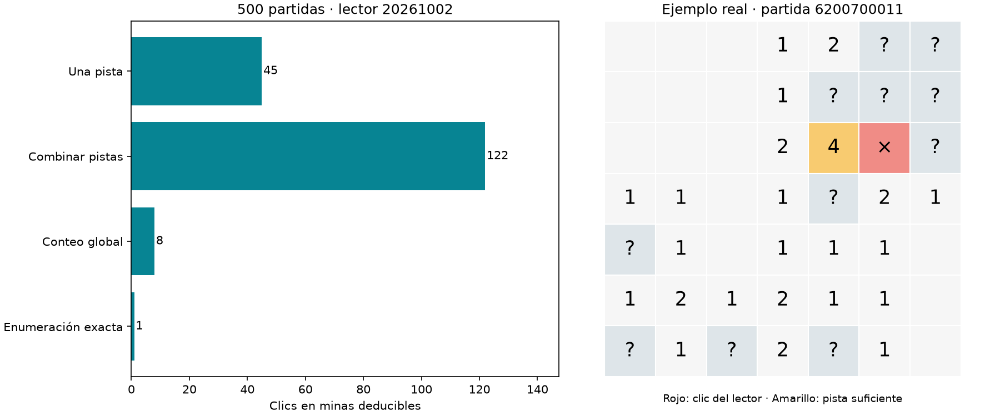

# Diagnóstico de clics en minas deducibles

Se auditó sin cambiar los modelos originales: ajuste sobre posiciones de entrenamiento disponibles para los tres lectores ampliados, validación original y repetición exacta de 500 partidas del lector 20261002. La repetición coincide partida por partida con victorias, clics, minas conocidas elegidas y oportunidades/elecciones seguras registradas anteriormente.

## Qué ocurre en partidas reales

De 176 clics en minas deducibles, **0 ocurrieron sin ninguna jugada certificada segura** y **176 teniendo al menos una alternativa segura**. El primer grupo no recibe supervisión en el esquema DAgger actual; el segundo sí pertenece al tipo de estado que entrenamos. En esta repetición el primer grupo fue cero: omitir estados sin solución segura NO explica los 176 errores observados. En todos había alguna casilla no certificada como mina. Elegir una mina demostrable no era una apuesta 50/50 inevitable.

Complejidad suficiente de prueba (clasificación jerárquica, no única): una pista 45, combinación de pistas locales 122, conteo global 8, enumeración exacta 1. La clasificación local usa el mismo cierre acotado del solver, por lo que no identifica necesariamente la prueba matemática más corta posible.

El ejemplo muestra únicamente la observación pública. La pista amarilla tiene tantos vecinos ocultos como minas indicadas, de modo que todos esos vecinos son minas. El lector escogió uno de ellos (rojo). No se usó el mapa oculto para certificarlo. El ejemplo también tenía una jugada segura disponible según el solver.

## El fallo también aparece en datos disponibles durante entrenamiento

| Lector | Posiciones disponibles | Elige mina deducible | De ellas, bastaba una pista |
|---|---|---|---|
| 20261002 | 14143 | 683 (4.83%) | 170 |
| 20261003 | 10217 | 480 (4.70%) | 152 |
| 20261004 | 10277 | 502 (4.88%) | 144 |

Son evaluaciones del checkpoint final sobre el conjunto que tenía disponible, no partidas independientes ni prueba de que cada fila apareciera en un minibatch. Se excluyen rondas posteriores al checkpoint seleccionado y se conserva la experiencia heredada. Para todos estos estados existía alguna acción segura etiquetada. La dificultad no se explica solamente por encontrar tableros nuevos o por omitir estados de apuestas.

## Qué enseña el objetivo actual

`equivalent_loss` pone una distribución uniforme sobre todas las jugadas certificadas seguras. Las demás casillas tienen objetivo cero: una mina conocida y una casilla de riesgo incierto no reciben etiquetas de riesgo diferentes. Sí hay penalización indirecta a la mina por softmax; sería incorrecto decir que se ignora por completo. Una prueba verifica que intercambiar logits entre dos acciones no seguras deja la pérdida igual.

Además, el colector descarta estados sin jugada segura. Por tanto, no enseña en esos estados a descartar minas demostrables y elegir entre las apuestas restantes. El enmascaramiento de inferencia solo excluye casillas ya abiertas/fuera del tablero; una mina deducible sigue siendo una acción legal. El replay exacto no mostró discrepancias de ejecución respecto a la evaluación anterior.

## Qué podemos concluir y qué falta

Hay errores residuales de ajuste incluso sobre posiciones disponibles. El hueco de estados sin solución segura existe, pero no explica los clics en minas observados en estas 500 partidas. La selección de acciones en el replay coincidió exactamente con la evaluación original; no apareció una discrepancia de índices o ejecución.

Una prueba adicional entrenó una copia temporal del lector sobre 32 errores heredados que se resolvían con una sola pista. Con la misma actividad congelada, arquitectura y pérdida, Adam nuevo lr 0.001, batch fijo de 32 y clipping 5, pasó de 0/32 a 32/32 decisiones seguras en 50 actualizaciones y mantuvo ese resultado hasta 500. No se guardó ni sirvió esa copia como nuevo agente. Es ajuste a un pequeño conjunto seleccionado por sus fallos, no prueba de generalización ni de aprendizaje de una regla abstracta. Sí descarta que estos 32 fallos particulares sean imposibles de corregir con la interfaz actual.

No se separan causalmente representación, capacidad y optimización para el resto del juego, ni se demuestra que la dinámica simplificada sea la causa. La pérdida actual también pudo ajustar esos 32 casos, por lo que todavía no hay evidencia de que sustituirla sea necesario.

**Siguiente experimento propuesto:** mantener cerebro, encoder, arquitectura y pérdida, y priorizar dentro del replay las posiciones de entrenamiento donde el lector elige una mina certificada pese a tener una alternativa segura. Mezclarlas con experiencia ordinaria para evitar olvidar otras situaciones. Comparar con muestreo uniforme a igual presupuesto y evaluar reducción de errores más victorias en tableros finales nuevos. Así se aísla primero la distribución de entrenamiento. Una tarea auxiliar por casilla para distinguir segura/mina podría evaluarse después, por separado. La priorización no se implementó ni entrenó en esta fase; solo se hizo la prueba temporal de ajuste a 32 ejemplos.

El benchmark previamente final se inspeccionó ahora con fines de diagnóstico: cualquier intervención posterior debe usar una evaluación final nueva. Fuentes, ejemplos completos, contadores y hashes en runs/mine-choice-diagnostic-001. Dos pruebas diagnósticas pasan; checkpoints originales intactos. El análisis de trayectoria cubre una semilla y los resultados de ajuste tres lectores sobre un único cerebro.
