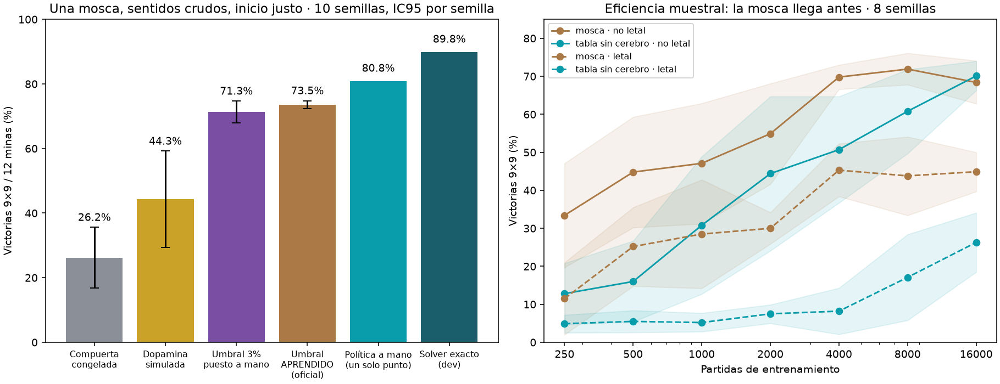

# La mosca que juega buscaminas — reporte consolidado

> **Actualización (21 sept, más tarde):** con un cambio en cómo combina sus olfateos (sección 6, primer punto) una mosca llega a **81.3%** en 9×9 (IC95 78.8–83.8; `runs/fly-aggregate-002`, semillas nuevas), a 3.5 pp de la política a mano en los mismos tableros. Las cifras de 73.5% de abajo son de la configuración anterior.

21 sept 2026 · sustituye a `REPORTE_MOSCA_MARCADORA.md` (que describe la primera versión, con sentidos que hoy clasificamos como trampa).
Todo número viene de `runs/*/summary.json`; la bitácora completa, incluidos los errores, está en `ESTADO.md`. El código de cada corrida quedó copiado en `runs/*/source/` y en git (etiquetas `hito/01` … `hito/08`).

*Izquierda: `runs/fly-gate-001` (500 tableros reservados). La barra de la política a mano viene de otro conjunto de tableros (`runs/fly-aggregate-001`); en conjuntos distintos ha dado entre 78.8% y 80.8%. El solver exacto se midió en tableros de desarrollo.*

## 1. El resultado en cinco líneas

1. **Una sola mosca simulada gana el 73.5% de las partidas de buscaminas 9×9 con 12 minas** (IC95 72.3–74.8, 10 semillas, tableros nunca vistos), aprendiendo únicamente de dos señales: calor cuando pisa una mina y azúcar cuando pisa una casilla segura. En 7×7 gana 84.0%.
2. Lo que aprende es suyo: los sentidos son crudos (la arena no divide ni resta nada por ella) y **hasta el umbral de cuándo marcar una mina lo descubre sola**, con recompensa retrasada. Quedó a 0.4 de distancia del valor que yo había puesto a ojo.
3. **Su ventaja real sobre un aprendiz sin cerebro es la eficiencia: necesita unas 4 veces menos experiencia.** Con experiencia ilimitada una tabla la empata.
4. **El conectoma concreto de la mosca no aporta nada medible.** Sirve la arquitectura (expansión dispersa a miles de unidades + lectura plástica gobernada por dopamina); barajar el cableado da lo mismo, y meter más estructura real lo empeora.
5. Le faltan ~7 puntos para igualar a una política de "un solo punto" escrita a mano (≈80%) y ~16 para un solver exacto (≈90%). El 85% de sus muertes son adivinanzas forzadas, no errores de deducción.

## 2. Qué es exactamente "la mosca"

- **Circuito.** El cuerpo pedunculado del conectoma MaleCNS con sus conteos reales de sinapsis: 314 neuronas de proyección olfativa (88 glomérulos) → 4,064 células de Kenyon → 97 neuronas de salida (MBON), con 316 dopaminérgicas PAM (recompensa) y 16 PPL1 (castigo). Modelo de tasas, sin spikes. La dirección de cada MBON (acercarse o evitar) se lee del propio cableado y coincide con la biología conocida.
- **Sentidos (crudos).** Cada casilla emite según su propio estado visible: una pista emite su número N; una casilla tapada emite olor "tapado"; una casilla que la mosca marcó emite su feromona. Los olores se suman igual en las ocho direcciones. Parada en una casilla tapada, la mosca antena una por una a sus vecinas abiertas y de cada una huele tres cantidades: **N**, **k** (cuánto tapado la rodea) y **m** (cuántas marcas propias la rodean). Nadie divide N/k ni resta marcas: esa relación la aprende el cerebro.
- **Aprendizaje.** Solo cambian las sinapsis Kenyon→MBON, con una regla local de tres factores: actividad presináptica × dopamina que llega a ese compartimento, con la dopamina modulada por la sorpresa. Sin backprop, sin red que piense antes, sin lector entrenado después.
- **Marcar.** Cuando un olfateo le da pavor, deja una marca de estrés y no pisa ahí. *Cuándo* es pavor suficiente lo decide una compuerta con un único parámetro, ajustado por una traza de elegibilidad y la dopamina de las pisadas siguientes. Nadie le dice si una marca fue correcta.
- **Entrenamiento.** 20,000 partidas alternando 7×7 y 9×9, con densidad de minas variable (8–25%) y sin morir al entrenar: la mina quema y enseña, la mosca marca esa casilla y sigue. **La evaluación siempre es letal**, con el inicio estándar moderno (la primera casilla y sus ocho vecinas sin minas).

## 3. Cómo se llegó aquí (lo que funcionó y lo que no)

| Paso | Qué cambió | Efecto medido |
|---|---|---|
| Línea original (backprop alrededor del conectoma congelado) | — | 9.8% en 9×9; los retoques al lector no rendían; con 1 ciclo solo 23,778 de 25.6 M de sinapsis participaban |
| Cuerpo pedunculado + dopamina, con olor N/k ya dividido y marcas que restan | primera mosca que juega | 44.5% por mosca (una de cada seis no aprendía a marcar). **Clasificado después como trampa**: una logística sin cerebro sacaba 47.5% |
| Olfateos crudos (N, k, m) | la arena deja de hacer la aritmética | 34.0%: un tercio del salto era de la arena, no todo. Por primera vez la mosca le gana por >20 pp a los aprendices sin cerebro |
| Entrenamiento no letal | más muestras de los olores temidos | +12.8 pp; desaparecen las moscas que no aprenden a marcar |
| Densidad de minas variable al entrenar | — | +7.4 pp en el 15% de siempre (yo había predicho que costaría) |
| Inicio justo (apertura en cascada) | observación de Felipe al ver el visor | +16.9 pp: el inicio viejo abría una sola casilla con número en el 74% de las partidas |
| Compuerta de marca aprendida | fuera el 3% puesto a mano | 73.5% vs 71.3% con el umbral a mano; menos varianza; θ aprendido −3.07 vs −3.48 a mano |

**Lo que no funcionó** (todo medido, no opinado): reflejos además de rotaciones; fusión aprendida de orientaciones; plasticidad sináptica con interfaz congelada; "entrada legible" (hacer legibles las pistas empeoró el juego); sentidos simbólicos 5×5; olor de fondo; castigo más fuerte que el premio (hace que marque todo el tablero); umbral de marca más laxo; currículum por densidad; sentido de densidad para la mosca; entrenar con inicio en cascada; entrenar en tableros grandes; código Kenyon más disperso; inhibición APL real; resistencia al ruido (un 15% de ruido en el olfato hunde a cualquiera de ~71% a ~28%).

## 4. Las tres conclusiones de fondo

**a) Sentido contra trampa.** La primera versión funcionaba porque la arena le resolvía el problema: N/k es la probabilidad de mina según una pista, y restar marcas es un paso de solver. Con sentidos crudos el número baja, pero el resultado pasa a ser de la mosca. El criterio operativo quedó en `ANALISIS_SENTIDOS_MOSCA.md`. Ideas muy "de mosca" que son fraude: probar la casilla con las patas, calor cerca de las minas.

**b) ¿Aporta algo el cerebro?** Sí, una cosa: aprende con ~4× menos experiencia que una tabla (70% a las 4,000 partidas; la tabla necesita 16,000). Con entrenamiento letal, donde la experiencia es escasa, va arriba en toda la curva (45% vs 8% a las 4,000 partidas). Con datos de sobra, la tabla empata. Y cuando la tarea pide conjunciones exactas de muchos atributos (memoria de pares de pistas), generalizar estorba: ahí la tabla gana.

**c) ¿Aporta algo el conectoma de la mosca?** No. Real contra barajado: sin diferencia ni en la meseta ni en las primeras miles de partidas, barajando la entrada, la salida o todo. La inhibición APL real empeora 12.5 pp. Es coherente con que el cuerpo pedunculado sea, a propósito, casi aleatorio en su entrada. No se probó la realimentación real MBON→dopaminérgicas.

## 5. Qué sigue puesto a mano (declarado)

La forma de los sentidos (qué emite cada casilla, olfateo por vecina); la codificación glomerular (firma aleatoria y sintonía en banda); el corte de actividad de las Kenyon al 20%; que exista el acto de marcar; la nitidez de la compuerta, su punto de partida conservador, la relación calor −3 / azúcar +1 y la traza 0.9; azúcar en cada pisada segura (el juego real solo dice ganaste o perdiste); la temperatura de exploración y el decaimiento de la tasa de aprendizaje.

## 6. Frentes abiertos

- **Promediar en vez de sumar los olfateos — RESUELTO y adoptado** (`runs/fly-aggregate-001` y `-002`). El 85% de las muertes eran adivinanzas forzadas y sumar hace que una casilla con muchas vecinas abiertas pese más solo por tener más. Promediar subía a 9 de 10 moscas a ~80% pero hundía a 1 de 10: al promediar, un olfateo de mina segura tenía que volverse extremo para pesar, y ese extremo se contagiaba a olores parecidos casi siempre seguros (marcas falsas). Arreglo: cada olfateo se condiciona por separado con el resultado y la mosca promedia sus opiniones. Confirmado con semillas que no se usaron al diseñarlo: **81.3% en 9×9** (suma 76.3%; +5.1 pp, p=0.011), 88.3% en 7×7, 57.3% en 16×16 (+13 pp), cero marcas falsas y ninguna mosca hundida. La política a mano en esos tableros: 84.8 / 91.2 / 61.3.
- **Memoria de pares de pistas** (frente 6): en pilotos sin mosca recupera casi todo el hueco hasta el solver (88.3% vs 89.8%) y sobrevive al aprendizaje por resultados (85.2% a 80 mil partidas). En la mosca solo dio ≈ +3 pp; sospecha sin probar: los 88 glomérulos no alcanzan para ligar siete atributos. Felipe decidió dejarlo ahí: ampliar la entrada ya no sería la mosca.
- **Cuerpo visible** (estacionado): conectar las MBON con las neuronas descendentes y ver a la mosca aprender en el visor.
- Réplica con semillas nuevas del 73.5% y de la curva de eficiencia (cada uno salió de una sola corrida).

## 7. Cómo citarlo bien

- "Una mosca" = **81.3%** en 9×9/12 minas (IC95 78.8–83.8), inicio en cascada, sentidos crudos, compuerta aprendida, cada olfateo por su cuenta (`runs/fly-aggregate-002`). Con la configuración anterior (suma): 73.5% en `runs/fly-gate-001`; los dos números vienen de conjuntos de tableros distintos.
- El 53.2% que llegó a ser "número oficial" era un **enjambre de 10 moscas que vota**, con sentidos de trampa y el inicio viejo: no es comparable y no cuenta como que la mosca mejoró. Con sentidos crudos el enjambre además rinde peor que una mosca sola.
- Los porcentajes de corridas distintas usan tableros distintos y a veces inicios distintos; las comparaciones limpias son siempre las internas de una misma corrida, pareadas por semilla.
- No hay spikes ni tiempos biológicos; "dopamina" es una señal escalar por compartimento. Es una arquitectura inspirada en el cuerpo pedunculado que usa sus conteos reales, no una simulación de una mosca.

## 8. Ver para creer

`scene/dist/arena.html` (con el servidor del visor: `http://127.0.0.1:8766/arena.html`): tablero 3D estilo buscaminas clásico, el 2D clásico al lado y el panel del cerebro, con partidas reales de una mosca entrenada. Se ve a la mosca olfatear cada pista (N · k · m), plantar sus marcas, dar el toque y recibir azúcar o calor.
