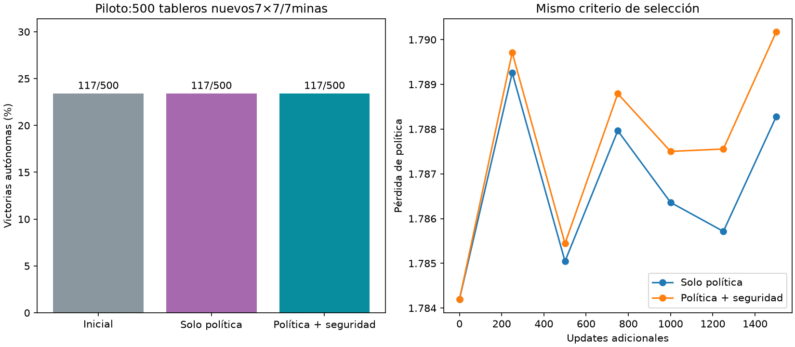

# Auxiliar de seguridad: piloto

Auxiliar−control **+0.00pp**,IC95%condicional [+0.00,+0.00]. Una semilla/un cerebro;no consistencia todavía.

| Variante | Victorias | Clics en minas deducibles |
|---|---|---|
| Inicial | 117/500 (23.4%) | 146 |
| Solo política | 117/500 (23.4%) | 146 |
| Política + seguridad | 117/500 (23.4%) | 146 |



Mismos pesos/Adam/RNG/batches/1500updates,mezcla32original+32DAggerheredado;encoder/cerebrocongelados. CEpolítica vsCE+0.2BCEcertificadossafe/mine,ramaaux33parámetros,ceroinicial. BCEbalancea clasespresentes;casillasinciertasnoetiquetadas. Maestro nofiltra acciones;inferencias usan sololector5×5original12,769parámetros. Tests confirman gradientesinciertas0,signoscorrectos yforwardpolíticainalteradoaladjuntarrama. CEya penalizaminas indirectamente;esto agregaobjetivo distinto,no muestreo prioritario.

Selecciónpor mismaCEpolítica enholdout0/cada250,sello antesde500testnuevos;0 aperturasautomáticasexcluidas. Métricasauxholdout son diagnóstico,no selección,controlauxceronoentrenado no es comparación de capacidad. Intervalos10000remuestreos pareados portablero. No comparar absolutosconotrascorridas. Auditó500layouts nuevos/solapamiento0,certificados públicos recomputados,todosdraws/selección/hashes/sello/conteos. Originales yservido intactos.

Protocolo `research/PROTOCOLO_AUXILIAR_RIESGO.md`,artefactos `runs/risk-auxiliary-001`.

```json
{
  "results": {
    "baseline": {
      "wins": 117,
      "n": 500,
      "automatic_excluded": 0,
      "known_mine_choices": 146,
      "safe_choices": 2501,
      "safe_opportunities": 2852
    },
    "control": {
      "wins": 117,
      "n": 500,
      "automatic_excluded": 0,
      "known_mine_choices": 146,
      "safe_choices": 2501,
      "safe_opportunities": 2852
    },
    "auxiliary": {
      "wins": 117,
      "n": 500,
      "automatic_excluded": 0,
      "known_mine_choices": 146,
      "safe_choices": 2501,
      "safe_opportunities": 2852
    }
  },
  "comparisons": {
    "control": {
      "delta_pp": 0.0,
      "conditional_ci95_pp": [
        0.0,
        0.0
      ]
    },
    "baseline": {
      "delta_pp": 0.0,
      "conditional_ci95_pp": [
        0.0,
        0.0
      ]
    }
  },
  "selection": {
    "control": {
      "step": 0,
      "validation_loss": 1.78419331741333,
      "sha256": "b1a73733241b73786cd65147329ff24973a8eead9731873d2735b144938305a2"
    },
    "auxiliary": {
      "step": 0,
      "validation_loss": 1.78419331741333,
      "sha256": "c62150daf873e297235ee45e97caf48abeba1157f926c2a45c7062beb2f8aca5"
    }
  },
  "automatic_excluded": 0
}
```
