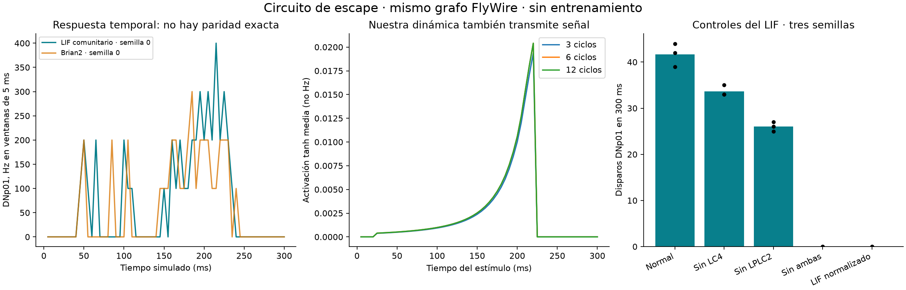

# Circuito de escape: comparación funcional

13 de septiembre de 2026. Experimento terminado, sin entrenamiento ni cambios a checkpoints de Buscaminas.

## Resultado que cambia el diagnóstico

La dinámica simplificada **sí transmite actividad hacia DNp01 por el circuito conocido**. La respuesta desaparece al silenciar LC4 y LPLC2. Por tanto, este experimento no respalda que usar tanh o tres ciclos destruya necesariamente este circuito. No demuestra que nuestra red pueda aprender las relaciones de Buscaminas.

## Diseño y procedencia

Mismo grafo FlyWire v783 exportado por Fruit Fly Laboratory: 139,255 nodos y 3,732,460 conexiones. Commit `26672e06427c12c61536ce1bd93dae7442944681`; hashes verificados contra su manifiesto. Neuronas de entrada/salida comprobadas contra sus tipos e IDs en el archivo de neuronas. **Copia comunitaria: no se reconstruyó ni verificó independientemente contra todos los archivos originales de FlyWire.** No es MaleCNS y no se trasplantaron nuestros checkpoints.

Fuente: [repositorio fijado](https://github.com/vaibhavkedarisetti/fruit-fly-lab/tree/26672e06427c12c61536ce1bd93dae7442944681). Modelo publicado: [Shiu, código y parámetros](https://github.com/philshiu/Drosophila_brain_model/blob/main/model.py).

Objeto con semitamaño 5 mm a 50 mm, azimut 45 grados, inicio 20 ms, velocidad 250 mm/s; desaparece al alcanzar distancia cero. Duración 300 ms, paso LIF 0.1 ms. Campos receptivos redondeados a tres decimales del export web; encoder de tamaño/expansión adaptado del repositorio, no visión de píxeles. Tres semillas 0/1/2; misma estimulación aleatoria para intervenciones emparejadas. El conteo es la suma de las dos neuronas DNp01.

La selectividad a acercamiento frente a alejamiento/objeto quieto está **introducida en el encoder**: estos dos controles reciben cero estímulo. No prueba que el conectoma descubra por sí solo la dirección del movimiento. Las lesiones con entrada idéntica sí prueban dependencia de propagación interna.

## LIF comunitario: mediciones locales

| Condición | Disparos DNp01, semillas 0/1/2 |
|---|---|
| Normal | 44, 39, 42 |
| Sin LC4 | 35, 33, 33 |
| Sin LPLC2 | 26, 25, 27 |
| Sin ambas | 0, 0, 0 |
| LIF normalizado | 0, 0, 0 |

Objeto quieto y alejándose: cero disparos, como se espera de sus entradas nulas. El lector nunca consulta la geometría para decidir si hay salida. No se simuló un cuerpo ni una partida de Dinosaurio: se midió el circuito neuronal.

## Dinámica local de tasas sobre el mismo grafo

Se reprodujeron normalización por suma absoluta entrante, ganancias unitarias, estado inicial tanh(entrada) y actualización tanh(W·estado + 0.15·entrada). Entrada = tasa sensorial / 150; es una conversión de ingeniería. Se reinicia estado por observación, como RetinaPolicy. No usamos encoder/decoder entrenados de Buscaminas, que esperan otro problema y otro grafo.

| Ciclos | Pico medio DNp01, unidades tanh |
|---|---:|
| 3 | 0.01936985 |
| 6 | 0.02041218 |
| 12 | 0.02040935 |

El aumento de 3 a 12 ciclos es 5.37%. Con ambas poblaciones cortadas, cero en las tres variantes. La amplitud tanh no es una frecuencia de disparo y no se compara numéricamente con Hz. Una salida pequeña tampoco implica por sí sola incapacidad: el decoder puede amplificarla.

## Verificación independiente con Brian2

Se ejecutaron las ecuaciones, umbrales, retardos y refractariedad publicados mediante Brian2 2.10.1, sobre el grafo completo y los mismos eventos externos de la semilla 0. Entrada en fase `synapses`, correspondiente a PoissonInput; el motor comunitario la aplica antes de comprobar umbral.

Brian2: **37 disparos**, primer disparo 42.4 ms; al cortar ambas entradas, **0**. Motor comunitario: **44 disparos**, primer disparo 41.900000000000006 ms. Hay replicación funcional, **no paridad numérica**. La planificación temporal y precisión son diferencias posibles; no aislamos toda la causa. No adoptarlo como implementación equivalente a Brian2 sin resolverlo.

## Qué demuestra el control de normalización

Aplicar la normalización entrante a los pesos del LIF, conservando el factor sináptico 0.275 mV y todos los demás parámetros, elimina los disparos de salida. Esto prueba que **no se pueden intercambiar escalas de pesos entre modelos sin recalibrar**. No prueba que la normalización sea mala para tanh: esa variante sí conserva señal.

## Decisión siguiente

El cuello de botella de Buscaminas sigue sin localizarse. Este circuito simple es un control positivo logrado, no un entrenamiento nuevo ni una validación de visión completa. No cambiar todo a LIF basándose en este ensayo.

Siguiente prueba recomendada: habilidades mínimas de Buscaminas (deducción de una pista), evaluación en configuraciones nuevas y lectura de información en entrada, capas intermedias y salida. Comparar contra CNN y grafo reconfigurado; comprobar en qué etapa deja de ser decodificable la respuesta. Mantener separada la réplica biológica de la investigación de aprendizaje.

## Reproducibilidad

Comandos desde la raíz: `.venv/bin/python -m experiments.escape_functional`, `.venv/bin/python -m experiments.escape_brian_reference`, `.venv/bin/python -m experiments.report_escape`. El primer comando rechaza sobrescribir una corrida completada. Resultados y fuentes fijadas: `runs/escape-functional-001/`; registro de descargas: `reference/escape-functional/sources.json`. Dependencias añadidas: brian2==2.10.1, matplotlib==3.11.2. Los controles emparejados e independientes se verifican al generar este informe.
