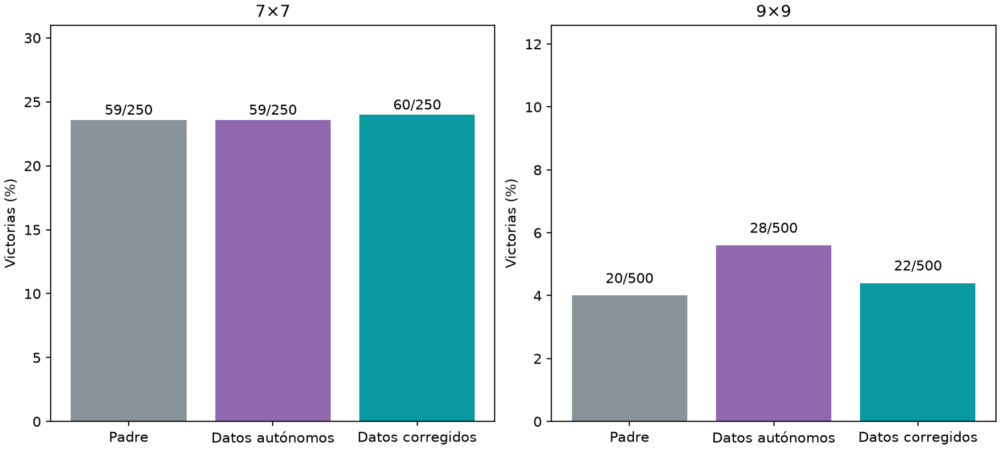

# Aprender de trayectorias con correcciones

Principal9×9, formación con correcciones−formación autónoma: -1.20pp,IC95%[-3.20,+0.80].



**Todas las partidas finales son autónomas.** El maestro solo intervino durante la recolección del brazo experimental. 400layouts9 de colección compartidos,1500updatesporbrazo,750testnuevos5009/2507. 16originales+16DAgger7+16experiencia9anterior+16experiencia nueva;mismo presupuesto y muestras de depósitos fijos. Trayectorias y cantidad de posiciones nuevas difieren: no se aísla profundidad como única causa. Cerebro yencoder congelados,todas las features recomputadas para elencoder actual;Adamlector/RNGheredados. Una semilla/un cerebro,último1500fijo antesdeltest,agente servido intacto.

Estadísticas de colección (incluyen asistencia; NO son resultados autónomos del entrenamiento):
```json
{
  "autonomous": {
    "positions": 2571,
    "mean_depth": 8.285103072734344,
    "mean_hidden": 36.02217036172696,
    "teacher_actions": 0,
    "collection_wins": 11
  },
  "assisted": {
    "positions": 5268,
    "mean_depth": 12.900531511009872,
    "mean_hidden": 30.46260440394837,
    "teacher_actions": 1883,
    "collection_wins": 226
  }
}
```

Evaluación autónoma:
```json
{
  "7": {
    "results": {
      "baseline": {
        "wins": 59,
        "n": 250,
        "safe_choices": 1177,
        "safe_opportunities": 1314,
        "known_mine_choices": 67,
        "death_with_safe_available": 88,
        "death_after_exact_half_min_risk": 0
      },
      "autonomous": {
        "wins": 59,
        "n": 250,
        "safe_choices": 1199,
        "safe_opportunities": 1349,
        "known_mine_choices": 72,
        "death_with_safe_available": 92,
        "death_after_exact_half_min_risk": 0
      },
      "assisted": {
        "wins": 60,
        "n": 250,
        "safe_choices": 1181,
        "safe_opportunities": 1330,
        "known_mine_choices": 71,
        "death_with_safe_available": 91,
        "death_after_exact_half_min_risk": 0
      }
    },
    "comparisons": {
      "autonomous": {
        "delta_pp": 0.4,
        "ci95_pp": [
          -3.5999999999999996,
          4.3999999999999995
        ]
      },
      "baseline": {
        "delta_pp": 0.4,
        "ci95_pp": [
          -4.0,
          4.3999999999999995
        ]
      }
    }
  },
  "9": {
    "results": {
      "baseline": {
        "wins": 20,
        "n": 500,
        "safe_choices": 2946,
        "safe_opportunities": 3463,
        "known_mine_choices": 207,
        "death_with_safe_available": 314,
        "death_after_exact_half_min_risk": 0
      },
      "autonomous": {
        "wins": 28,
        "n": 500,
        "safe_choices": 3187,
        "safe_opportunities": 3707,
        "known_mine_choices": 198,
        "death_with_safe_available": 310,
        "death_after_exact_half_min_risk": 0
      },
      "assisted": {
        "wins": 22,
        "n": 500,
        "safe_choices": 3031,
        "safe_opportunities": 3548,
        "known_mine_choices": 200,
        "death_with_safe_available": 305,
        "death_after_exact_half_min_risk": 0
      }
    },
    "comparisons": {
      "autonomous": {
        "delta_pp": -1.2,
        "ci95_pp": [
          -3.2,
          0.8
        ]
      },
      "baseline": {
        "delta_pp": 0.4,
        "ci95_pp": [
          -1.6,
          2.4
        ]
      }
    }
  }
}
```
