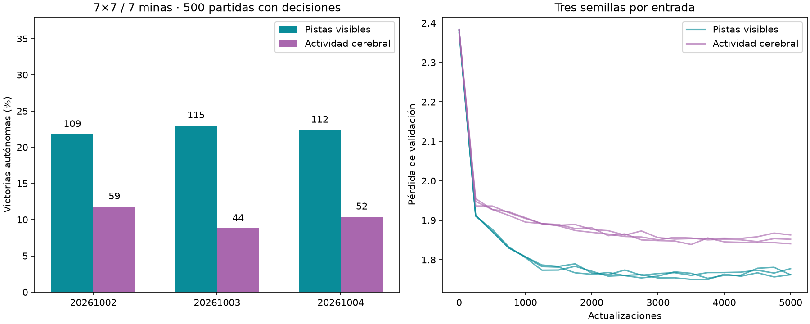

# Comparación controlada: pistas visibles y actividad cerebral

Pistas visibles: **22.40%** de victorias autónomas; actividad cerebral: **10.33%**. Diferencia pistas menos cerebro **+12.07 puntos porcentuales**, IC95% condicional [+9.00, +15.13].

| Semilla | Pistas visibles | Actividad cerebral | Updates elegidos: pistas / cerebro |
|---|---|---|---|
| 20261002 | 109/500 | 59/500 | 3750 / 3500 |
| 20261003 | 115/500 | 44/500 | 3500 / 3250 |
| 20261004 | 112/500 | 52/500 | 3750 / 4500 |



Ambos lectores tienen 12,769 parámetros y reciben diez canales espaciales más tamaño/número de minas públicos. Inicialización y minibatches idénticos dentro de cada par, comprobados por hash. Cada lector se entrenó desde cero durante 5,000 actualizaciones Adam sobre las mismas 10,000 posiciones originales. Se eligió mínima pérdida en el holdout histórico de 1,000 posiciones (paso0 y cada250) antes de evaluar. No hay nuevos datos DAgger en esta comparación.

Los 500 layouts finales 7×7/7 minas son nuevos, compartidos por los seis lectores y disjuntos de datasets/listas de juegos previos. Hay 0 aperturas ganadoras automáticas excluidas. Los intervalos usan 10,000 remuestreos por tablero y promedian las diferencias entre las tres semillas dentro del tablero. Son condicionales a estos lectores y un único cerebro previamente entrenado; no son 1,500 tableros independientes ni tres cerebros.

## Alcance

Las pistas directas superaron a la actividad cerebral en las tres semillas. La diferencia pareada es consistente en este benchmark y señala una dificultad adicional de la representación cerebral actual para el mismo lector. Sin embargo, el control directo también queda en22.4%: esta prueba no explica todo el estancamiento. La CNN anterior de43.6% usaba ReLU y una tercera convolución dilatada (campo receptivo9×9), frente a dos convoluciones tanh y5×5 aquí, además de otro benchmark; no son controles intercambiables.

La siguiente hipótesis propuesta es adaptar conjuntamente el encoder y el lector espacial conservando las conexiones del conectoma fijas, con control congelado y nueva evaluación. No se inició esta fase ni se ha demostrado que resuelva la brecha.

Esta prueba mide la facilidad de uso de dos representaciones por este lector y presupuesto. Una ventaja de pistas directas implica un coste de la representación cerebral actual, que incluye encoder, dinámica, normalización y pooling. No localiza cuál de esos componentes lo causa ni demuestra una imposibilidad biológica o de otras interfaces. Las escalas originales se conservaron: también forman parte de la representación comparada. Igual presupuesto adicional de los lectores no implica igual cómputo histórico; el cerebro ya estaba entrenado y quedó congelado. El holdout histórico se ha reutilizado; la evidencia nueva es la evaluación final.

Las cifras no son una comparación directa con el ~20% de los lectores refinados con DAgger y otros benchmarks. Las etiquetas del maestro se usan al entrenar y para registrar métricas; las decisiones finales no reciben un filtro de casillas seguras. La máscara de acciones solo excluye abiertas/fuera del tablero.

## Métricas por trayectoria

```json
{
  "raw-20261002": {
    "wins": 109,
    "n": 500,
    "automatic_excluded": 0,
    "seconds": 1.2887864579679444,
    "known_mine_choices": 135,
    "safe_choices": 2133,
    "safe_opportunities": 2502
  },
  "brain-20261002": {
    "wins": 59,
    "n": 500,
    "automatic_excluded": 0,
    "seconds": 57.4101666250499,
    "known_mine_choices": 183,
    "safe_choices": 1804,
    "safe_opportunities": 2278
  },
  "raw-20261003": {
    "wins": 115,
    "n": 500,
    "automatic_excluded": 0,
    "seconds": 1.4034445410361513,
    "known_mine_choices": 148,
    "safe_choices": 2267,
    "safe_opportunities": 2654
  },
  "brain-20261003": {
    "wins": 44,
    "n": 500,
    "automatic_excluded": 0,
    "seconds": 50.03556270792615,
    "known_mine_choices": 192,
    "safe_choices": 1763,
    "safe_opportunities": 2195
  },
  "raw-20261004": {
    "wins": 112,
    "n": 500,
    "automatic_excluded": 0,
    "seconds": 1.2450950409984216,
    "known_mine_choices": 137,
    "safe_choices": 2242,
    "safe_opportunities": 2589
  },
  "brain-20261004": {
    "wins": 52,
    "n": 500,
    "automatic_excluded": 0,
    "seconds": 48.7874978329055,
    "known_mine_choices": 200,
    "safe_choices": 1803,
    "safe_opportunities": 2271
  }
}
```

Las oportunidades seguras y minas deducibles elegidas dependen de trayectorias distintas; comparar sus denominadores. No convertir las muertes de azar en victorias.

Auditoría: reconstrucción de500 layouts, solapamiento previo0, elección recalculada, conteos individuales cotejados, sello y hashes originales intactos. Metadatos del caché exactamente iguales a las filas y16 mapas recomputados contra el checkpoint. Se conservan pesos/Adam/RNG mejores y últimos. Ningún agente servido sustituido. Protocolo: `research/PROTOCOLO_COMPARACION_ENTRADAS.md`. Artefactos: `runs/input-representation-001`.
