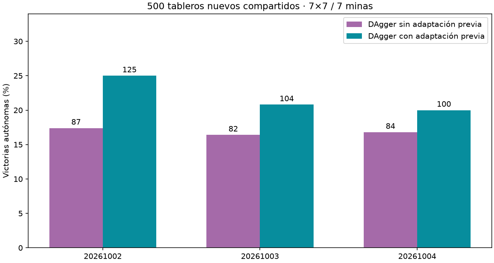

# Aporte de adaptación previa a DAgger

Sinadaptar **16.87%**, adaptando **21.93%**. Diferencia adaptado−noadaptado **+5.07pp**, IC95% condicional [+2.87,+7.20].

| Semilla | DAgger sin adaptar | DAgger adaptado | Diferencia(pp) |
|---|---|---|---|
| 20261002 | 87/500 | 125/500 | +7.6 |
| 20261003 | 82/500 | 104/500 | +4.4 |
| 20261004 | 84/500 | 100/500 | +3.2 |



Comparación de pipelines completos, no ablación aislada delencoder. Ambas etapasprevias tuvieron3000updates nominales para selección de checkpoints; adaptarentrada también cambia lector/Adam/RNG y cuesta más tiempo. DAgger despuéscongelóencoderycerebro y entrenó lector2250updates con iguales900layoutsdecolección porpareja,misma mezcla50%original50%experiencia. Trayectorias y datosresultantes pueden diferir. Losadaptados existentes se preservaron;losnoadaptados se entrenaronahora desdecontrolprevio. Misma pérdida/regladeholdout,sello antesdefinal500layouts nuevosdisjuntos. 0 aperturasganadoras automáticas excluidas.

Bootstrap10000 remuestreos pareadosportablero,promedioentresemillas,condicional a estosmodelos;un cerebro500tableroscompartidos,no1500independientes. No demuestra ventaja anatómica ni generalidad. No comparar absolutosconotrosbenchmarks. Maestroacciones0.

Auditoría final500layoutsreconstruidos/solapamiento0,colección900 porpareja coincidey reconstruida,selección/encoderfijo/teacheracciones0/hashes/sello/conteosverificados. Originales preservados,ningún agenteservido cambiado. Protocolo `research/PROTOCOLO_COMPARACION_INTERFACES_DAGGER.md`;artefactos `runs/dagger-interface-comparison-001`.

```json
{
  "comparisons": {
    "all": {
      "unadapted_mean_pct": 16.866666666666667,
      "adapted_mean_pct": 21.93333333333333,
      "delta_pp": 5.066666666666666,
      "conditional_ci95_pp": [
        2.8666666666666667,
        7.199999999999999
      ]
    },
    "20261002": {
      "unadapted_mean_pct": 17.4,
      "adapted_mean_pct": 25.0,
      "delta_pp": 7.6,
      "conditional_ci95_pp": [
        4.0,
        11.200000000000001
      ]
    },
    "20261003": {
      "unadapted_mean_pct": 16.400000000000002,
      "adapted_mean_pct": 20.8,
      "delta_pp": 4.3999999999999995,
      "conditional_ci95_pp": [
        0.8,
        8.0
      ]
    },
    "20261004": {
      "unadapted_mean_pct": 16.8,
      "adapted_mean_pct": 20.0,
      "delta_pp": 3.2,
      "conditional_ci95_pp": [
        0.0,
        6.2
      ]
    }
  },
  "results": {
    "20261002-unadapted": {
      "wins": 87,
      "n": 500,
      "automatic_excluded": 0,
      "known_mine_choices": 172,
      "safe_choices": 2151,
      "safe_opportunities": 2518
    },
    "20261002-adapted": {
      "wins": 125,
      "n": 500,
      "automatic_excluded": 0,
      "known_mine_choices": 137,
      "safe_choices": 2396,
      "safe_opportunities": 2708
    },
    "20261003-unadapted": {
      "wins": 82,
      "n": 500,
      "automatic_excluded": 0,
      "known_mine_choices": 171,
      "safe_choices": 2112,
      "safe_opportunities": 2486
    },
    "20261003-adapted": {
      "wins": 104,
      "n": 500,
      "automatic_excluded": 0,
      "known_mine_choices": 152,
      "safe_choices": 2316,
      "safe_opportunities": 2648
    },
    "20261004-unadapted": {
      "wins": 84,
      "n": 500,
      "automatic_excluded": 0,
      "known_mine_choices": 167,
      "safe_choices": 2103,
      "safe_opportunities": 2458
    },
    "20261004-adapted": {
      "wins": 100,
      "n": 500,
      "automatic_excluded": 0,
      "known_mine_choices": 150,
      "safe_choices": 2238,
      "safe_opportunities": 2560
    }
  },
  "steps": {
    "20261002-unadapted": 2000,
    "20261002-adapted": 2250,
    "20261003-unadapted": 2250,
    "20261003-adapted": 1750,
    "20261004-unadapted": 1750,
    "20261004-adapted": 2250
  },
  "shared_layouts": 500,
  "automatic_excluded": 0
}
```
