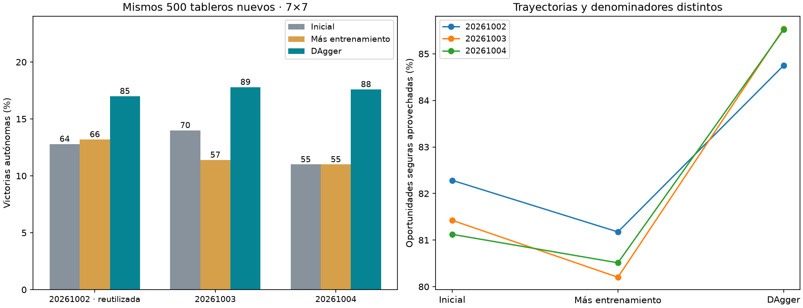

# Consistencia de DAgger espacial

DAgger superó al lector inicial y al control de igual presupuesto en las tres semillas. Media de victorias: inicial 12.60%, control 11.87%, DAgger 17.47%. Las dos repeticiones nuevas dieron una ventaja media de +6.50 puntos frente al control, IC95% condicional [+4.00,+9.10]. Esto respalda continuar con DAgger en esta configuración; el rendimiento absoluto sigue siendo bajo y no demuestra utilidad específica del cableado biológico.

| Semilla del lector | Inicial | Más entrenamiento con datos antiguos | DAgger |
|---|---|---|---|
| 20261002 (reutilizada) | 64/500 (12.8%) | 66/500 (13.2%) | 85/500 (17.0%) |
| 20261003 (nueva) | 70/500 (14.0%) | 57/500 (11.4%) | 89/500 (17.8%) |
| 20261004 (nueva) | 55/500 (11.0%) | 55/500 (11.0%) | 88/500 (17.6%) |



## Comparaciones emparejadas

```json
{
  "all": {
    "baseline": {
      "delta_pp": 4.866666666666666,
      "conditional_ci95_pp": [
        2.8000000000000003,
        7.0666666666666655
      ],
      "per_seed_delta_pp": {
        "20261002": 4.2,
        "20261003": 3.8,
        "20261004": 6.6000000000000005
      }
    },
    "control": {
      "delta_pp": 5.6000000000000005,
      "conditional_ci95_pp": [
        3.599999999999999,
        7.7333333333333325
      ],
      "per_seed_delta_pp": {
        "20261002": 3.8,
        "20261003": 6.4,
        "20261004": 6.6000000000000005
      }
    }
  },
  "new_only": {
    "baseline": {
      "delta_pp": 5.2,
      "conditional_ci95_pp": [
        2.8000000000000003,
        7.7
      ],
      "per_seed_delta_pp": {
        "20261003": 3.8,
        "20261004": 6.6000000000000005
      }
    },
    "control": {
      "delta_pp": 6.5,
      "conditional_ci95_pp": [
        4.0,
        9.1
      ],
      "per_seed_delta_pp": {
        "20261003": 6.4,
        "20261004": 6.6000000000000005
      }
    }
  }
}
```

Los intervalos remuestrean 500 tableros completos 10,000 veces, promediando diferencias dentro de cada tablero entre las semillas indicadas. Condicionados a estos lectores, no estiman toda la variabilidad de posibles entrenamientos. No son 1,500 tableros independientes. La primera semilla reutiliza el piloto; las otras dos constituyen las repeticiones nuevas. Los nueve modelos se midieron en el mismo benchmark nuevo, reservado antes de entrenar.

## Protocolo

Dos nuevas semillas de lector sobre el mismo cerebro/encoder/mapa congelados. Cada una parte de su checkpoint ampliado con Adam. Tres rondas de 300 partidas autónomas y 750 actualizaciones para DAgger y control. Batch 64; DAgger mezcla 32 posiciones antiguas y 32 nuevas acumuladas. Se reutilizan intencionalmente los mismos 900 layouts de colección del piloto entre semillas; cada lector produce sus propias trayectorias. Maestro solo etiqueta jugadas certificadas seguras, sin ejecutar acciones ni rescatar muertes. Estados de apuestas sin jugada segura no reciben etiquetas.

Selección exclusiva por pérdida en validación original, incluyendo baseline. Las actualizaciones seleccionadas pueden diferir; presupuesto de entrenamiento máximo igual entre brazos. 500 layouts finales 7×7/7 minas nuevos, excluidos de datasets/benchmarks/colección anteriores, apertura central segura idéntica; 0 victorias automáticas excluidas. No se consultaron resultados finales para seleccionar checkpoints.

## Métricas del juego

```json
{
  "20261002": {
    "baseline": {
      "wins": 64,
      "n": 500,
      "safe_choices": 1816,
      "safe_opportunities": 2207,
      "known_mine_choices": 189,
      "death_with_safe_available": 256
    },
    "control": {
      "wins": 66,
      "n": 500,
      "safe_choices": 1850,
      "safe_opportunities": 2279,
      "known_mine_choices": 192,
      "death_with_safe_available": 257
    },
    "dagger": {
      "wins": 85,
      "n": 500,
      "safe_choices": 2045,
      "safe_opportunities": 2413,
      "known_mine_choices": 169,
      "death_with_safe_available": 234
    }
  },
  "20261003": {
    "baseline": {
      "wins": 70,
      "n": 500,
      "safe_choices": 1828,
      "safe_opportunities": 2245,
      "known_mine_choices": 172,
      "death_with_safe_available": 248
    },
    "control": {
      "wins": 57,
      "n": 500,
      "safe_choices": 1823,
      "safe_opportunities": 2273,
      "known_mine_choices": 191,
      "death_with_safe_available": 276
    },
    "dagger": {
      "wins": 89,
      "n": 500,
      "safe_choices": 2195,
      "safe_opportunities": 2566,
      "known_mine_choices": 157,
      "death_with_safe_available": 230
    }
  },
  "20261004": {
    "baseline": {
      "wins": 55,
      "n": 500,
      "safe_choices": 1689,
      "safe_opportunities": 2082,
      "known_mine_choices": 190,
      "death_with_safe_available": 250
    },
    "control": {
      "wins": 55,
      "n": 500,
      "safe_choices": 1698,
      "safe_opportunities": 2109,
      "known_mine_choices": 187,
      "death_with_safe_available": 257
    },
    "dagger": {
      "wins": 88,
      "n": 500,
      "safe_choices": 2108,
      "safe_opportunities": 2465,
      "known_mine_choices": 161,
      "death_with_safe_available": 217
    }
  }
}
```

Las oportunidades seguras tienen denominadores distintos porque las políticas recorren posiciones diferentes. Las minas conocidas elegidas y muertes con alternativa segura son errores evitables según el solver de observación pública, no pérdidas inevitables por azar.

## Alcance y conservación

Comparación de lectores sobre un único cerebro congelado: no demuestra ventaja de la anatomía ni rendimiento en tableros grandes. Fuentes, hashes, pesos/Adam/RNG, etiquetas y resultados por partida conservados en las corridas. Ningún checkpoint original ni agente servido se sustituyó.
