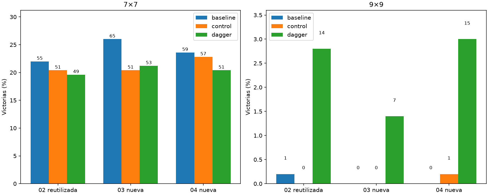

# Consistencia DAgger9×9

Principal dos semillas nuevas,9×9,DAgger−control: +2.10pp, IC95%pareado[+1.20,+3.10].



Cada barra etiqueta victorias absolutas; denominadores500en9 y250en7 salvo aperturasautomáticas excluidas detalladas abajo. Dos nuevos pares2250updates;piloto02solo reevaluado. Últimos2250fijados antesdeltest, sin selección por partidas. 900layouts de colección compartidos entre dos nuevos con trayectorias propias;750test nuevos compartidos por tres políticas. Bootstrap remuestrea layouts conjuntamente, no cerebros. Con pocos éxitos puede ser degenerado. Cerebro/encodercongelados,maestroetiqueta pero no actúa, agente servido sin cambios. La comparación de retención7 es secundaria y no debe ocultarse tras mejora9.

```json
{
  "7": {
    "results": {
      "20261002-baseline": {
        "wins": 55,
        "n": 250,
        "safe_choices": 1115,
        "safe_opportunities": 1276,
        "known_mine_choices": 61,
        "death_with_safe_available": 92,
        "death_after_exact_half_min_risk": 1
      },
      "20261002-control": {
        "wins": 51,
        "n": 250,
        "safe_choices": 1076,
        "safe_opportunities": 1263,
        "known_mine_choices": 67,
        "death_with_safe_available": 101,
        "death_after_exact_half_min_risk": 0
      },
      "20261002-dagger": {
        "wins": 49,
        "n": 250,
        "safe_choices": 1105,
        "safe_opportunities": 1287,
        "known_mine_choices": 73,
        "death_with_safe_available": 101,
        "death_after_exact_half_min_risk": 0
      },
      "20261003-baseline": {
        "wins": 65,
        "n": 250,
        "safe_choices": 1274,
        "safe_opportunities": 1440,
        "known_mine_choices": 64,
        "death_with_safe_available": 95,
        "death_after_exact_half_min_risk": 1
      },
      "20261003-control": {
        "wins": 51,
        "n": 250,
        "safe_choices": 1134,
        "safe_opportunities": 1317,
        "known_mine_choices": 66,
        "death_with_safe_available": 100,
        "death_after_exact_half_min_risk": 2
      },
      "20261003-dagger": {
        "wins": 53,
        "n": 250,
        "safe_choices": 1038,
        "safe_opportunities": 1222,
        "known_mine_choices": 69,
        "death_with_safe_available": 99,
        "death_after_exact_half_min_risk": 0
      },
      "20261004-baseline": {
        "wins": 59,
        "n": 250,
        "safe_choices": 1179,
        "safe_opportunities": 1334,
        "known_mine_choices": 59,
        "death_with_safe_available": 92,
        "death_after_exact_half_min_risk": 1
      },
      "20261004-control": {
        "wins": 57,
        "n": 250,
        "safe_choices": 1068,
        "safe_opportunities": 1269,
        "known_mine_choices": 59,
        "death_with_safe_available": 103,
        "death_after_exact_half_min_risk": 1
      },
      "20261004-dagger": {
        "wins": 51,
        "n": 250,
        "safe_choices": 1058,
        "safe_opportunities": 1256,
        "known_mine_choices": 71,
        "death_with_safe_available": 115,
        "death_after_exact_half_min_risk": 1
      }
    },
    "comparisons": {
      "new_two": {
        "control": {
          "delta_pp": -0.8,
          "ci95_pp": [
            -4.0,
            2.4
          ]
        },
        "baseline": {
          "delta_pp": -4.0,
          "ci95_pp": [
            -7.6,
            -0.4
          ]
        }
      },
      "all_three": {
        "control": {
          "delta_pp": -0.7999999999999998,
          "ci95_pp": [
            -3.3333333333333335,
            1.8666666666666665
          ]
        },
        "baseline": {
          "delta_pp": -3.4666666666666672,
          "ci95_pp": [
            -6.4,
            -0.5333333333333334
          ]
        }
      }
    }
  },
  "9": {
    "results": {
      "20261002-baseline": {
        "wins": 1,
        "n": 500,
        "safe_choices": 1217,
        "safe_opportunities": 1871,
        "known_mine_choices": 202,
        "death_with_safe_available": 316,
        "death_after_exact_half_min_risk": 0
      },
      "20261002-control": {
        "wins": 0,
        "n": 500,
        "safe_choices": 1103,
        "safe_opportunities": 1736,
        "known_mine_choices": 196,
        "death_with_safe_available": 322,
        "death_after_exact_half_min_risk": 0
      },
      "20261002-dagger": {
        "wins": 14,
        "n": 500,
        "safe_choices": 2613,
        "safe_opportunities": 3125,
        "known_mine_choices": 218,
        "death_with_safe_available": 313,
        "death_after_exact_half_min_risk": 0
      },
      "20261003-baseline": {
        "wins": 0,
        "n": 500,
        "safe_choices": 1011,
        "safe_opportunities": 1594,
        "known_mine_choices": 187,
        "death_with_safe_available": 295,
        "death_after_exact_half_min_risk": 0
      },
      "20261003-control": {
        "wins": 0,
        "n": 500,
        "safe_choices": 960,
        "safe_opportunities": 1526,
        "known_mine_choices": 189,
        "death_with_safe_available": 300,
        "death_after_exact_half_min_risk": 0
      },
      "20261003-dagger": {
        "wins": 7,
        "n": 500,
        "safe_choices": 2586,
        "safe_opportunities": 3112,
        "known_mine_choices": 220,
        "death_with_safe_available": 314,
        "death_after_exact_half_min_risk": 0
      },
      "20261004-baseline": {
        "wins": 0,
        "n": 500,
        "safe_choices": 1058,
        "safe_opportunities": 1640,
        "known_mine_choices": 185,
        "death_with_safe_available": 302,
        "death_after_exact_half_min_risk": 0
      },
      "20261004-control": {
        "wins": 1,
        "n": 500,
        "safe_choices": 975,
        "safe_opportunities": 1543,
        "known_mine_choices": 179,
        "death_with_safe_available": 292,
        "death_after_exact_half_min_risk": 0
      },
      "20261004-dagger": {
        "wins": 15,
        "n": 500,
        "safe_choices": 2721,
        "safe_opportunities": 3268,
        "known_mine_choices": 230,
        "death_with_safe_available": 322,
        "death_after_exact_half_min_risk": 0
      }
    },
    "comparisons": {
      "new_two": {
        "control": {
          "delta_pp": 2.1,
          "ci95_pp": [
            1.2,
            3.1
          ]
        },
        "baseline": {
          "delta_pp": 2.1999999999999997,
          "ci95_pp": [
            1.3,
            3.3000000000000003
          ]
        }
      },
      "all_three": {
        "control": {
          "delta_pp": 2.333333333333333,
          "ci95_pp": [
            1.4666666666666666,
            3.3333333333333326
          ]
        },
        "baseline": {
          "delta_pp": 2.3333333333333335,
          "ci95_pp": [
            1.4666666666666666,
            3.3333333333333326
          ]
        }
      }
    }
  }
}
```
