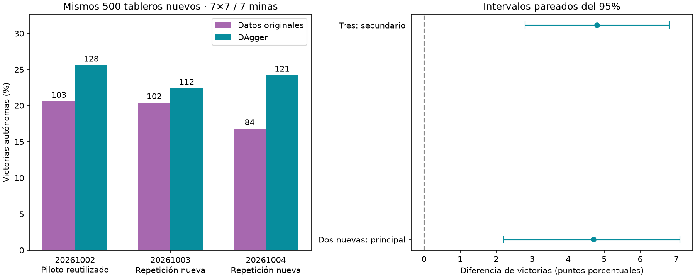

# Consistencia de DAgger con interfaz adaptada

Comparación principal de las DOS semillas nuevas: **18.60%→23.30%**, diferencia **+4.70 puntos**, IC95% condicional [+2.20,+7.10]. El piloto reutilizado se excluye del análisis principal porque su resultado motivó la repetición.

| Semilla | Inicial | Control | DAgger | Diferencia vs control (pp) |
|---|---|---|---|---|
| 20261002 | 103/500 | 103/500 | 128/500 | +5.0 |
| 20261003 | 102/500 | 102/500 | 112/500 | +2.0 |
| 20261004 | 81/500 | 84/500 | 121/500 | +7.4 |



Dos entrenamientos nuevos con2250updates por brazo en3rondas300partidascoleccion, Adam/RNG iniciales iguales dentro de cada par, batch64, mismas tasas y clipping del piloto. DAgger mezcla50%original50%experiencia;control100%original. Encoder adaptado congelado. Maestrosoloetiqueta,acciones0. Cada semilla parte de su checkpoint cerebral previo. El piloto20261002 no se reentrenó. Selección original holdoutcada250 incluyendoinicial sellada para los seis candidatos antes de probar500layouts nuevos compartidos7×7/7minas. 0 aperturas ganadoras automáticas excluidas. Grafo y ganancias fijos. Sin reemplazo del agente servido.

Intervalos de10000 remuestreos por tablero, promediando las diferencias entre semillas dentro del tablero. Condicionados a estos modelos; un único cerebro,500tableros compartidos, no1500 observaciones independientes. Tres semillas de lector no establecen universalidad ni ventaja anatómica. Mismo número de actualizaciones, tamaño de lote y parámetros entrenables; DAgger cambia la distribución de ejemplos e incluye el costo de recoger partidas. No comparar directamente con el~20% de modelos DAgger en otros benchmarks.

```json
{
  "comparisons": {
    "new_seeds": {
      "control_mean_pct": 18.6,
      "dagger_mean_pct": 23.299999999999997,
      "delta_pp": 4.7,
      "conditional_ci95_pp": [
        2.1999999999999997,
        7.1
      ]
    },
    "all_seeds": {
      "control_mean_pct": 19.266666666666666,
      "dagger_mean_pct": 24.066666666666666,
      "delta_pp": 4.8,
      "conditional_ci95_pp": [
        2.8000000000000003,
        6.800000000000001
      ]
    },
    "20261002": {
      "control_mean_pct": 20.599999999999998,
      "dagger_mean_pct": 25.6,
      "delta_pp": 5.0,
      "conditional_ci95_pp": [
        1.7999999999999998,
        8.200000000000001
      ]
    },
    "20261003": {
      "control_mean_pct": 20.4,
      "dagger_mean_pct": 22.400000000000002,
      "delta_pp": 2.0,
      "conditional_ci95_pp": [
        -1.2,
        5.2
      ]
    },
    "20261004": {
      "control_mean_pct": 16.8,
      "dagger_mean_pct": 24.2,
      "delta_pp": 7.3999999999999995,
      "conditional_ci95_pp": [
        3.8,
        10.8
      ]
    }
  },
  "results": {
    "20261002-baseline": {
      "wins": 103,
      "n": 500,
      "automatic_excluded": 0,
      "known_mine_choices": 134,
      "safe_choices": 2081,
      "safe_opportunities": 2454
    },
    "20261002-control": {
      "wins": 103,
      "n": 500,
      "automatic_excluded": 0,
      "known_mine_choices": 134,
      "safe_choices": 2081,
      "safe_opportunities": 2454,
      "duplicate_of": "20261002-baseline"
    },
    "20261002-dagger": {
      "wins": 128,
      "n": 500,
      "automatic_excluded": 0,
      "known_mine_choices": 108,
      "safe_choices": 2280,
      "safe_opportunities": 2564
    },
    "20261003-baseline": {
      "wins": 102,
      "n": 500,
      "automatic_excluded": 0,
      "known_mine_choices": 146,
      "safe_choices": 2145,
      "safe_opportunities": 2517
    },
    "20261003-control": {
      "wins": 102,
      "n": 500,
      "automatic_excluded": 0,
      "known_mine_choices": 146,
      "safe_choices": 2145,
      "safe_opportunities": 2517,
      "duplicate_of": "20261003-baseline"
    },
    "20261003-dagger": {
      "wins": 112,
      "n": 500,
      "automatic_excluded": 0,
      "known_mine_choices": 122,
      "safe_choices": 2181,
      "safe_opportunities": 2477
    },
    "20261004-baseline": {
      "wins": 81,
      "n": 500,
      "automatic_excluded": 0,
      "known_mine_choices": 156,
      "safe_choices": 1855,
      "safe_opportunities": 2212
    },
    "20261004-control": {
      "wins": 84,
      "n": 500,
      "automatic_excluded": 0,
      "known_mine_choices": 144,
      "safe_choices": 1877,
      "safe_opportunities": 2252
    },
    "20261004-dagger": {
      "wins": 121,
      "n": 500,
      "automatic_excluded": 0,
      "known_mine_choices": 133,
      "safe_choices": 2292,
      "safe_opportunities": 2602
    }
  },
  "selected_steps": {
    "20261002-baseline": 0,
    "20261002-control": 0,
    "20261002-dagger": 2250,
    "20261003-baseline": 0,
    "20261003-control": 0,
    "20261003-dagger": 1750,
    "20261004-baseline": 0,
    "20261004-control": 1500,
    "20261004-dagger": 2250
  },
  "shared_layouts": 500,
  "automatic_excluded": 0
}
```

Auditoría independiente:1400layouts reconstruidos,solapamiento previo0,reglas de selección recalculadas,maestro sin acciones,conteos,hashes y sello correctos. Duplicados de evaluación solo por encoder+lector idénticos. Cachés de actividad separados por encoder. Pruebas gradientes/forward del protocolo conservadas. Fuentes y checkpoints en `runs/adapted-dagger-consistency-001` y sus dos corridas de entrenamiento. Protocolo `research/PROTOCOLO_CONSISTENCIA_DAGGER_ADAPTADO.md`.
