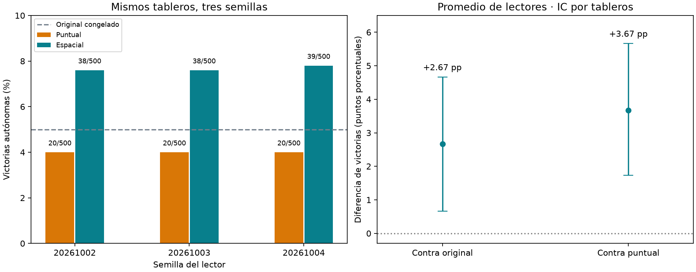

# Consistencia del decoder espacial

Corrida `spatial-consistency-001`, terminada. Tres semillas de lector y un único cerebro congelado; 500 layouts nuevos de 7×7/7 minas, reservados antes de entrenar.

## Resultados autónomos

Original congelado: **25/500 (5.0%)**. Se excluyen 0 victorias por apertura automática. Ningún maestro elige acciones.

| Semilla del lector | Puntual (capacidad comparable) | Espacial |
|---|---|---|
| 20261002 | 20/500 (4.0%) | 38/500 (7.6%) |
| 20261003 | 20/500 (4.0%) | 38/500 (7.6%) |
| 20261004 | 20/500 (4.0%) | 39/500 (7.8%) |

Promedios entre tres lectores: puntual 4.00%, espacial 7.67%. El espacial supera al puntual en 3/3 semillas y al original en 3/3.



## Comparación emparejada

Cada política juega los mismos tableros. `spatial_only` indica partidas que gana solo el espacial; `control_only`, solo el comparador. Diferencia media y percentiles de 10,000 remuestreos emparejados de tableros:

```json
{
  "original": {
    "pairs": [
      {
        "seed": 20261002,
        "spatial_only": 23,
        "control_only": 10,
        "difference_pp": 2.6,
        "mcnemar_exact_p": 0.03508203336969018
      },
      {
        "seed": 20261003,
        "spatial_only": 24,
        "control_only": 11,
        "difference_pp": 2.6,
        "mcnemar_exact_p": 0.040959591511636986
      },
      {
        "seed": 20261004,
        "spatial_only": 25,
        "control_only": 11,
        "difference_pp": 2.8000000000000003,
        "mcnemar_exact_p": 0.028816719655878845
      }
    ],
    "mean_difference_pp": 2.6666666666666665,
    "conditional_board_bootstrap_95_pp": [
      0.6666666666666667,
      4.666666666666666
    ]
  },
  "pointwise": {
    "pairs": [
      {
        "seed": 20261002,
        "spatial_only": 28,
        "control_only": 10,
        "difference_pp": 3.5999999999999996,
        "mcnemar_exact_p": 0.0050976432976312935
      },
      {
        "seed": 20261003,
        "spatial_only": 27,
        "control_only": 9,
        "difference_pp": 3.5999999999999996,
        "mcnemar_exact_p": 0.00393317302223295
      },
      {
        "seed": 20261004,
        "spatial_only": 29,
        "control_only": 10,
        "difference_pp": 3.8,
        "mcnemar_exact_p": 0.0033778479119064286
      }
    ],
    "mean_difference_pp": 3.6666666666666674,
    "conditional_board_bootstrap_95_pp": [
      1.7333333333333332,
      5.666666666666666
    ]
  }
}
```

Los intervalos quedan **condicionados a los tres lectores entrenados**. No cuantifican incertidumbre entre todos los posibles entrenamientos o cerebros. Son 500 layouts compartidos, no 1,500 independientes. Los p-valores exactos por semilla son exploratorios y no están corregidos por comparaciones múltiples.

## Qué se mantuvo fijo

Arquitecturas del piloto (~12.8k parámetros cada una), 1,000 updates, batch64, Adam lr0.001, clipping5, minibatches balanceados por tamaño/categoría. Las semillas20261003/4 se entrenaron desde cero; la20261002 se reutilizó sin cambios. Selección por pérdida de validación cada100 updates; no se eligió una semilla por sus partidas finales.

Mismo checkpoint cerebral retina_plastic-20260926, congelado junto con encoder, ganancias y mapa óptico. Mismas 10,000 posiciones train y 1,000 valid. El único camino de las pistas del tablero hacia el lector pasa por la actividad neuronal. Contexto público: tamaño/cantidad de minas. Esto verifica consistencia del **lector**, no tres entrenamientos completos del cerebro.

Los 500 layouts se excluyeron de los datasets previos y listas de partidas guardadas, incluidos los del piloto espacial. 5×5 no se volvió a presentar como prueba inédita porque su universo de layouts quedó agotado.

## Optimización y verificación

Se reutilizaron cachés de entrenamiento inmutables. En inferencia se memoriza únicamente el mapa neuronal determinista, mediante hash de observación pública y contexto. Los lectores no comparten decisiones ni labels. Aciertos de caché: 13232; mapas nuevos: 5437; reutilización 70.9%. No se infiere de este porcentaje un speedup igual: también hay costes del entorno, solver diagnóstico y cabeza.

La caché y el lector original se comprobaron contra forward original en un batch mixto5×5/7×7 y al reordenarlo; resultados compatibles dentro de tolerancia y reordenado exacto. Hashes de cachés, dataset y checkpoints originales comprobados al finalizar. Fuentes, manifest, selección, pesos y resultados por partida preservados en la carpeta de corrida.

Selección por validación:
```json
[
  {
    "variant": "pointwise",
    "seed": 20261002,
    "step": 900,
    "validation_loss": 1.977694465637207,
    "seconds": 0.0
  },
  {
    "variant": "spatial",
    "seed": 20261002,
    "step": 1000,
    "validation_loss": 1.8953465118408204,
    "seconds": 0.0
  },
  {
    "variant": "pointwise",
    "seed": 20261003,
    "step": 1000,
    "validation_loss": 1.979226354598999,
    "seconds": 38.77259412501007
  },
  {
    "variant": "spatial",
    "seed": 20261003,
    "step": 1000,
    "validation_loss": 1.9064737148284912,
    "seconds": 17.545562791987322
  },
  {
    "variant": "pointwise",
    "seed": 20261004,
    "step": 700,
    "validation_loss": 1.9750962467193605,
    "seconds": 37.76641883305274
  },
  {
    "variant": "spatial",
    "seed": 20261004,
    "step": 1000,
    "validation_loss": 1.9045378665924073,
    "seconds": 16.853306374978274
  }
]
```

## Alcance de la decisión

Esta prueba permite decidir si seguir investigando lectura espacial bajo este entrenamiento. No demuestra que el conectoma supere una CNN convencional, ni generalización a16×16, ni que el cerebro congelado esté adquiriendo estrategias. El nivel absoluto de victorias debe valorarse junto con la mejora relativa.

No se modificó el agente servido ni se desplegó el modelo automáticamente. Mantener este benchmark como evaluación final; no ajustar repetidamente arquitectura o hiperparámetros mirando sus resultados.

Reproducir: `.venv/bin/python -m experiments.validate_spatial_decoder` (rechaza sobrescritura) y `.venv/bin/python -m experiments.report_spatial_consistency`. Requiere la caché y checkpoint del piloto, cuyos hashes están en manifest.json.
