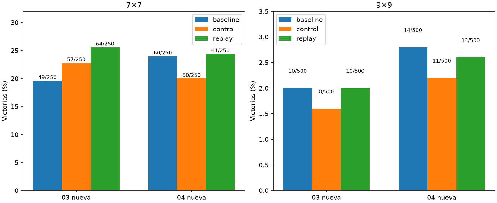

# Consistencia de repaso7×7

Principal dos nuevas,7×7repaso−control: +3.60pp,IC95%[+0.60,+6.60].



Dos réplicas1500updates fijos desdeparent9paso2250. Mismos32ejemplos9enambosbrazos,repaso sustituye16originalespor16DAgger7heredados. Test750porréplica,1500layouts únicos nuevos en total,compartidos entre brazos dentro de réplica. Intervalos bootstrap estratificados por semilla ypareados por layout,condicionales a un cerebro. Piloto02excluido. Coste9secundario debe informarse;no inferir no-inferioridad de unintervalo inconcluso. Auditorías individuales de pesos/datos/mapeo/índices/cache/endpoint pasan. Agente servido preservado.

```json
{
  "per_seed": {
    "20261003": {
      "7": {
        "results": {
          "baseline": {
            "wins": 49,
            "n": 250,
            "safe_choices": 1091,
            "safe_opportunities": 1259,
            "known_mine_choices": 71,
            "death_with_safe_available": 105,
            "death_after_exact_half_min_risk": 1
          },
          "control": {
            "wins": 57,
            "n": 250,
            "safe_choices": 1186,
            "safe_opportunities": 1356,
            "known_mine_choices": 70,
            "death_with_safe_available": 104,
            "death_after_exact_half_min_risk": 3
          },
          "replay": {
            "wins": 64,
            "n": 250,
            "safe_choices": 1258,
            "safe_opportunities": 1416,
            "known_mine_choices": 73,
            "death_with_safe_available": 100,
            "death_after_exact_half_min_risk": 1
          }
        },
        "comparisons": {
          "control": {
            "delta_pp": 2.8000000000000003,
            "ci95_pp": [
              -2.0,
              7.6
            ]
          },
          "baseline": {
            "delta_pp": 6.0,
            "ci95_pp": [
              0.8,
              11.200000000000001
            ]
          }
        }
      },
      "9": {
        "results": {
          "baseline": {
            "wins": 10,
            "n": 500,
            "safe_choices": 2553,
            "safe_opportunities": 3087,
            "known_mine_choices": 214,
            "death_with_safe_available": 317,
            "death_after_exact_half_min_risk": 2
          },
          "control": {
            "wins": 8,
            "n": 500,
            "safe_choices": 2450,
            "safe_opportunities": 2962,
            "known_mine_choices": 218,
            "death_with_safe_available": 317,
            "death_after_exact_half_min_risk": 0
          },
          "replay": {
            "wins": 10,
            "n": 500,
            "safe_choices": 2500,
            "safe_opportunities": 3007,
            "known_mine_choices": 205,
            "death_with_safe_available": 315,
            "death_after_exact_half_min_risk": 0
          }
        },
        "comparisons": {
          "control": {
            "delta_pp": 0.4,
            "ci95_pp": [
              -0.6,
              1.4000000000000001
            ]
          },
          "baseline": {
            "delta_pp": 0.0,
            "ci95_pp": [
              -1.4000000000000001,
              1.4000000000000001
            ]
          }
        }
      }
    },
    "20261004": {
      "7": {
        "results": {
          "baseline": {
            "wins": 60,
            "n": 250,
            "safe_choices": 1285,
            "safe_opportunities": 1457,
            "known_mine_choices": 78,
            "death_with_safe_available": 111,
            "death_after_exact_half_min_risk": 0
          },
          "control": {
            "wins": 50,
            "n": 250,
            "safe_choices": 1050,
            "safe_opportunities": 1221,
            "known_mine_choices": 74,
            "death_with_safe_available": 106,
            "death_after_exact_half_min_risk": 0
          },
          "replay": {
            "wins": 61,
            "n": 250,
            "safe_choices": 1146,
            "safe_opportunities": 1299,
            "known_mine_choices": 67,
            "death_with_safe_available": 97,
            "death_after_exact_half_min_risk": 0
          }
        },
        "comparisons": {
          "control": {
            "delta_pp": 4.3999999999999995,
            "ci95_pp": [
              0.8,
              8.0
            ]
          },
          "baseline": {
            "delta_pp": 0.4,
            "ci95_pp": [
              -4.0,
              4.8
            ]
          }
        }
      },
      "9": {
        "results": {
          "baseline": {
            "wins": 14,
            "n": 500,
            "safe_choices": 2649,
            "safe_opportunities": 3134,
            "known_mine_choices": 212,
            "death_with_safe_available": 315,
            "death_after_exact_half_min_risk": 0
          },
          "control": {
            "wins": 11,
            "n": 500,
            "safe_choices": 2641,
            "safe_opportunities": 3151,
            "known_mine_choices": 223,
            "death_with_safe_available": 322,
            "death_after_exact_half_min_risk": 0
          },
          "replay": {
            "wins": 13,
            "n": 500,
            "safe_choices": 2747,
            "safe_opportunities": 3266,
            "known_mine_choices": 228,
            "death_with_safe_available": 326,
            "death_after_exact_half_min_risk": 0
          }
        },
        "comparisons": {
          "control": {
            "delta_pp": 0.4,
            "ci95_pp": [
              -0.6,
              1.4000000000000001
            ]
          },
          "baseline": {
            "delta_pp": -0.2,
            "ci95_pp": [
              -1.6,
              1.2
            ]
          }
        }
      }
    }
  },
  "new_two_comparisons": {
    "7": {
      "control": {
        "delta_pp": 3.5999999999999996,
        "ci95_pp": [
          0.5999999999999999,
          6.6000000000000005
        ]
      },
      "baseline": {
        "delta_pp": 3.2,
        "ci95_pp": [
          -0.2,
          6.6000000000000005
        ]
      }
    },
    "9": {
      "control": {
        "delta_pp": 0.4,
        "ci95_pp": [
          -0.3,
          1.0999999999999999
        ]
      },
      "baseline": {
        "delta_pp": -0.1,
        "ci95_pp": [
          -1.0999999999999999,
          0.9000000000000001
        ]
      }
    }
  }
}
```
