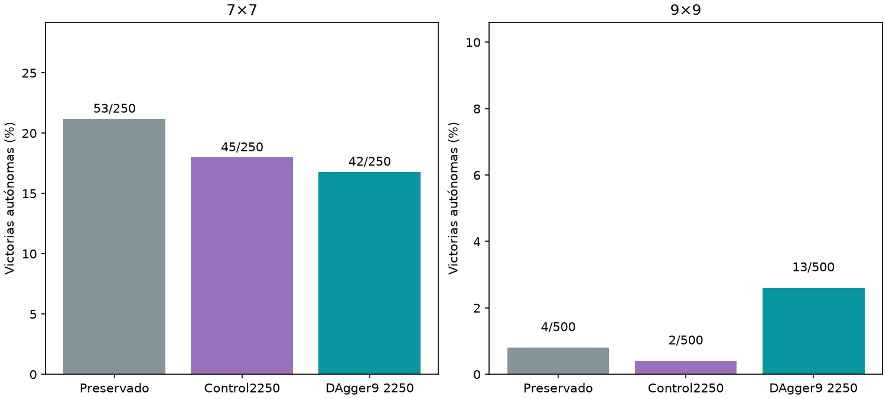

# DAgger con experiencia de9×9

Principal9×9, DAgger−control: +2.20pp, IC95%pareado[+1.00,+3.60].



Se fijaron los últimos2250 updates antes del test. Los mejores por pérdida antigua son diagnósticos y no fueron evaluados aquí. Una semilla/un cerebro,500 layouts nuevos9×9 y250 nuevos7×7 compartidos entre brazos. 900 partidas autónomas de colección, etiquetas públicas, cero acciones del maestro; 50%datos pequeños originales en DAgger frente100%originales encontrol, mismo presupuesto de updates. Cerebro y encoder congelados; no se cambió agente servido. No confundir caída de pérdida con mejora de victorias. Intervalo bootstrap con cero eventos puede ser degenerado y no prueba tasa verdadera cero. El solver certifica solo parte de las deducciones posibles.

```json
{
  "7": {
    "results": {
      "baseline": {
        "wins": 53,
        "n": 250,
        "safe_choices": 971,
        "safe_opportunities": 1105,
        "known_mine_choices": 62,
        "death_with_safe_available": 88,
        "death_after_exact_half_min_risk": 0
      },
      "control": {
        "wins": 45,
        "n": 250,
        "safe_choices": 907,
        "safe_opportunities": 1057,
        "known_mine_choices": 65,
        "death_with_safe_available": 95,
        "death_after_exact_half_min_risk": 0
      },
      "dagger": {
        "wins": 42,
        "n": 250,
        "safe_choices": 915,
        "safe_opportunities": 1079,
        "known_mine_choices": 80,
        "death_with_safe_available": 105,
        "death_after_exact_half_min_risk": 0
      }
    },
    "comparisons": {
      "control": {
        "delta_pp": -1.2,
        "ci95_pp": [
          -5.6000000000000005,
          3.2
        ]
      },
      "baseline": {
        "delta_pp": -4.3999999999999995,
        "ci95_pp": [
          -8.799999999999999,
          0.0
        ]
      }
    }
  },
  "9": {
    "results": {
      "baseline": {
        "wins": 4,
        "n": 500,
        "safe_choices": 1219,
        "safe_opportunities": 1831,
        "known_mine_choices": 173,
        "death_with_safe_available": 312,
        "death_after_exact_half_min_risk": 0
      },
      "control": {
        "wins": 2,
        "n": 500,
        "safe_choices": 1112,
        "safe_opportunities": 1766,
        "known_mine_choices": 178,
        "death_with_safe_available": 320,
        "death_after_exact_half_min_risk": 0
      },
      "dagger": {
        "wins": 13,
        "n": 500,
        "safe_choices": 2567,
        "safe_opportunities": 3063,
        "known_mine_choices": 216,
        "death_with_safe_available": 313,
        "death_after_exact_half_min_risk": 0
      }
    },
    "comparisons": {
      "control": {
        "delta_pp": 2.1999999999999997,
        "ci95_pp": [
          1.0,
          3.5999999999999996
        ]
      },
      "baseline": {
        "delta_pp": 1.7999999999999998,
        "ci95_pp": [
          0.6,
          3.2
        ]
      }
    }
  }
}
```
