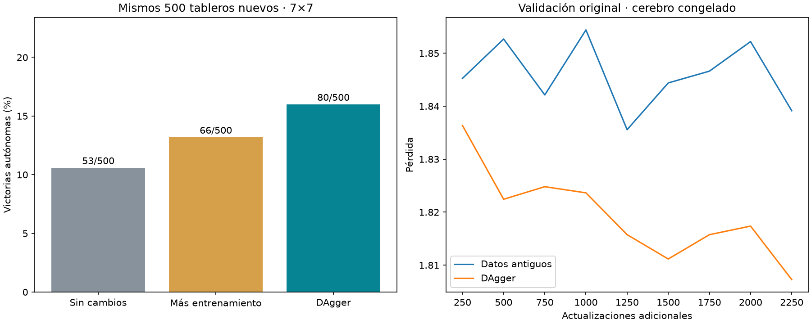

# DAgger sobre el lector espacial: piloto terminado

Un único lector, semilla 20261002, sobre el cerebro congelado. Tres rondas de 300 partidas de colección y 750 actualizaciones; 2,250 actualizaciones adicionales por variante. Se compara con el mismo checkpoint inicial y un control con el mismo presupuesto de actualizaciones sobre datos antiguos.

| Variante | Victorias | Jugadas seguras tomadas / disponibles | Minas conocidas elegidas | Muertes con alternativa segura | Update seleccionado |
|---|---|---|---|---|---|
| Sin cambios | 53/500 (10.6%) | 1800/2238 | 203 | 268 | 0 |
| Más entrenamiento | 66/500 (13.2%) | 1843/2268 | 200 | 260 | 1250 |
| DAgger | 80/500 (16.0%) | 2126/2507 | 181 | 241 | 2250 |



DAgger menos baseline: +5.40 puntos porcentuales, IC95% emparejado [2.1999999999999997, 8.799999999999999]. DAgger menos control de actualizaciones: +2.80 pp, IC95% [-0.6, 6.2]. Bootstrap de 10,000 remuestreos de tableros, condicionado a este único entrenamiento.

En este piloto, DAgger mejora frente al checkpoint inicial. La diferencia frente al control con igual presupuesto tiene un intervalo que incluye cero: todavía no demuestra una ventaja atribuible a DAgger. El siguiente paso recomendado es repetir la comparación con las otras dos semillas y otro benchmark reservado, antes de escalar rondas o modificar el cerebro.

Los 500 layouts finales son nuevos, reservados antes de recoger datos; separados de los 900 layouts de colección y todos los datasets/benchmarks previos. Apertura central segura idéntica; se excluyeron 0 victorias automáticas. Ninguna acción del maestro durante colección o evaluación. Las trayectorias de las variantes difieren: los denominadores de oportunidades seguras también.

## Recolección y selección

DAgger beta=0: el alumno decide todos los clics y termina si muere. El maestro etiqueta únicamente estados con alguna jugada certificada segura a partir de observación pública; no aporta el mapa de minas. Se incluyen aciertos y errores del alumno. Mitad del minibatch proviene de las posiciones originales equilibradas por tamaño/categoría y mitad de todas las posiciones acumuladas. No se enseña a resolver apuestas sin jugada segura en este piloto.

Colección por ronda:
```json
[
  {
    "games": 300,
    "wins": 27,
    "clicks": 1963,
    "safe_opportunities": 1331,
    "safe_choices": 1073,
    "teacher_actions": 0
  },
  {
    "games": 300,
    "wins": 44,
    "clicks": 2004,
    "safe_opportunities": 1500,
    "safe_choices": 1262,
    "teacher_actions": 0
  },
  {
    "games": 300,
    "wins": 54,
    "clicks": 2242,
    "safe_opportunities": 1664,
    "safe_choices": 1447,
    "teacher_actions": 0
  }
]
```

La selección usa exclusivamente la pérdida en las 1,000 posiciones originales de validación y permite conservar el checkpoint inicial (update 0). Los resultados finales de juego no intervienen en selección. El lector utilizado para recoger cada ronda es el estado más reciente, aunque la selección final elija un estado anterior.

## Verificación y alcance

Prueba del colector contra trayectorias independientes verifica que ejecuta las acciones del alumno, incluidos errores, y conserva etiquetas y tableros correctos. Cinco pruebas del colector, memoización y lector pasan. Checkpoints previos preservados mediante SHA256; los nuevos conservan pesos, Adam y RNG. Actividad neuronal cacheada sin compartir decisiones.

Es una prueba de adaptación del lector con un solo cerebro y una sola semilla, no evidencia de ventaja biológica ni generalización a tableros grandes. Los datos nuevos solo son 7×7; validar retención en otras dificultades requiere otra evaluación. Los contadores de muerte en apuestas exactas 50/50 están en summary.json y no se convierten en victorias ficticias. No se sustituyó el agente servido.
