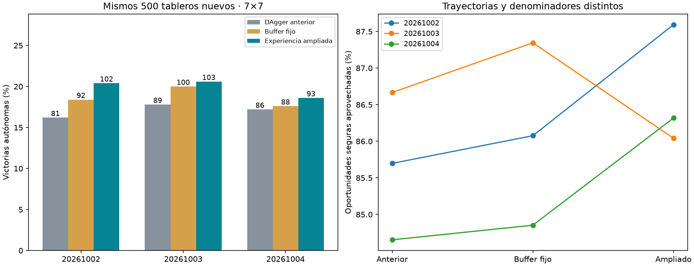

# Ampliación de experiencia DAgger

La ampliación ganó nominalmente más partidas en las tres semillas. Frente al DAgger anterior, la media subió +2.80 puntos (IC95% condicional [+0.93,+4.67]). Frente a continuar sobre la experiencia ya recogida, la ventaja fue +1.20 puntos (IC95% [−0.60,+3.00]): esta fase no establece un beneficio claro de recoger más datos frente a seguir entrenando con el buffer existente.

Los errores evitables persisten: clics en minas deducibles anterior→ampliado 170→176, 155→179 y 180→184 por cada 500 partidas. Las trayectorias se alargan y cambian; estos conteos no aíslan por sí solos la calidad por decisión. Las muertes con alternativa segura fueron 249→245, 224→245 y 243→241. Conviene diagnosticar esos errores antes de ampliar nuevamente el presupuesto.

| Semilla | DAgger anterior | Continuar con buffer fijo | Experiencia ampliada |
|---|---|---|---|
| 20261002 | 81/500 (16.2%) | 92/500 (18.4%) | 102/500 (20.4%) |
| 20261003 | 89/500 (17.8%) | 100/500 (20.0%) | 103/500 (20.6%) |
| 20261004 | 86/500 (17.2%) | 88/500 (17.6%) | 93/500 (18.6%) |

Media entre lectores: anterior 17.07%, buffer fijo 18.67%, ampliado 19.87%.



## Diferencias emparejadas

```json
{
  "baseline": {
    "mean_delta_pp": 2.8000000000000003,
    "conditional_ci95_pp": [
      0.9333333333333335,
      4.666666666666666
    ],
    "per_seed_delta_pp": {
      "20261002": 4.2,
      "20261003": 2.8000000000000003,
      "20261004": 1.4000000000000001
    }
  },
  "control": {
    "mean_delta_pp": 1.2,
    "conditional_ci95_pp": [
      -0.6,
      3.0
    ],
    "per_seed_delta_pp": {
      "20261002": 2.0,
      "20261003": 0.6,
      "20261004": 1.0
    }
  }
}
```

Bootstrap de 10,000 remuestreos por tablero, promedio de las diferencias entre lectores dentro de cada tablero. Intervalos condicionados a estas tres semillas; son 500 layouts compartidos, no 1,500 independientes. Un único cerebro congelado. Los modelos anteriores se volvieron a evaluar en este benchmark, sin comparar porcentajes de conjuntos distintos.

## Experimento

Tres rondas de 600 partidas nuevas y 750 actualizaciones por semilla. Baseline intacto: mejor DAgger anterior. Control y ampliado parten de ese mismo checkpoint con pesos, Adam y RNG. Batch 64: 32 posiciones originales equilibradas por tamaño/categoría y 32 de experiencia DAgger. El control mantiene fijo el buffer heredado; el ampliado agrega todas las nuevas posiciones recogidas. Ambos reciben 2,250 updates adicionales.

El maestro solo etiqueta posiciones con alguna jugada certificada segura desde observación pública. El lector ejecuta todas las acciones, incluidos errores, y termina al morir. No se etiquetan apuestas sin jugada segura ni se convierten pérdidas 50/50 en victorias. Apertura central segura automática igual para todos.

Selección por pérdida mínima en el holdout original, cada 250 updates, incluyendo baseline; el estado usado durante colección puede diferir del checkpoint finalmente elegido. Ningún resultado final de juego se usó para seleccionar. Nuevos 500 layouts finales y 1,800 de colección, excluidos de todos los datasets/benchmarks/colección previos; colección compartida entre lectores con trayectorias propias.

Selección por semilla:
```json
{
  "20261002": {
    "baseline": {
      "wins": 81,
      "n": 500,
      "selected_step": 0
    },
    "control": {
      "wins": 92,
      "n": 500,
      "selected_step": 1750
    },
    "expanded": {
      "wins": 102,
      "n": 500,
      "selected_step": 2000
    }
  },
  "20261003": {
    "baseline": {
      "wins": 89,
      "n": 500,
      "selected_step": 0
    },
    "control": {
      "wins": 100,
      "n": 500,
      "selected_step": 1750
    },
    "expanded": {
      "wins": 103,
      "n": 500,
      "selected_step": 1500
    }
  },
  "20261004": {
    "baseline": {
      "wins": 86,
      "n": 500,
      "selected_step": 0
    },
    "control": {
      "wins": 88,
      "n": 500,
      "selected_step": 750
    },
    "expanded": {
      "wins": 93,
      "n": 500,
      "selected_step": 1250
    }
  }
}
```

## Métricas específicas

```json
{
  "20261002": {
    "baseline": {
      "wins": 81,
      "n": 500,
      "safe_choices": 2253,
      "safe_opportunities": 2629,
      "known_mine_choices": 170,
      "death_with_safe_available": 249,
      "death_after_exact_half_min_risk": 0
    },
    "control": {
      "wins": 92,
      "n": 500,
      "safe_choices": 2312,
      "safe_opportunities": 2686,
      "known_mine_choices": 164,
      "death_with_safe_available": 228,
      "death_after_exact_half_min_risk": 0
    },
    "expanded": {
      "wins": 102,
      "n": 500,
      "safe_choices": 2591,
      "safe_opportunities": 2958,
      "known_mine_choices": 176,
      "death_with_safe_available": 245,
      "death_after_exact_half_min_risk": 0
    }
  },
  "20261003": {
    "baseline": {
      "wins": 89,
      "n": 500,
      "safe_choices": 2132,
      "safe_opportunities": 2460,
      "known_mine_choices": 155,
      "death_with_safe_available": 224,
      "death_after_exact_half_min_risk": 0
    },
    "control": {
      "wins": 100,
      "n": 500,
      "safe_choices": 2119,
      "safe_opportunities": 2426,
      "known_mine_choices": 144,
      "death_with_safe_available": 202,
      "death_after_exact_half_min_risk": 1
    },
    "expanded": {
      "wins": 103,
      "n": 500,
      "safe_choices": 2330,
      "safe_opportunities": 2708,
      "known_mine_choices": 179,
      "death_with_safe_available": 245,
      "death_after_exact_half_min_risk": 0
    }
  },
  "20261004": {
    "baseline": {
      "wins": 86,
      "n": 500,
      "safe_choices": 2212,
      "safe_opportunities": 2613,
      "known_mine_choices": 180,
      "death_with_safe_available": 243,
      "death_after_exact_half_min_risk": 0
    },
    "control": {
      "wins": 88,
      "n": 500,
      "safe_choices": 2308,
      "safe_opportunities": 2720,
      "known_mine_choices": 189,
      "death_with_safe_available": 253,
      "death_after_exact_half_min_risk": 0
    },
    "expanded": {
      "wins": 93,
      "n": 500,
      "safe_choices": 2391,
      "safe_opportunities": 2770,
      "known_mine_choices": 184,
      "death_with_safe_available": 241,
      "death_after_exact_half_min_risk": 0
    }
  }
}
```

Las oportunidades seguras tienen denominadores distintos por trayectoria. Minas conocidas elegidas y muertes con alternativa segura son errores evitables según el solver público. El contador de muertes en apuestas exactas 50/50 se conserva separado.

Se recogieron 27,898 posiciones nuevas (9,648 / 9,220 / 9,030). Los checkpoints elegidos no usan necesariamente todas: las semillas segunda y tercera fueron seleccionadas durante la segunda ronda y sus terceros lotes no contribuyen a esos pesos. La experiencia nueva disponible al entrenar cada checkpoint elegido fue 9,648 / 5,925 / 5,904 posiciones, además de la heredada.

Cinco pruebas del colector/memo/lector pasan. Auditorías por semilla verificaron todas las etiquetas nuevas desde observación pública, conservación de las filas heredadas, separación de layouts, continuidad de contadores de Adam, doce pares de restauraciones con siguiente actualización exacta, pesos/estado finitos y hashes originales intactos. Las muestras de actividad cacheada (cuatro posiciones de cada ronda y semilla) coincidieron con el cálculo directo, error máximo 0. Esto es una comprobación muestreada, no una reejecución de toda la caché.

Fuentes, datasets, actividad por ronda, mejores/últimos checkpoints con Adam/RNG y hashes originales conservados. No se sustituyó agente servido. No se demuestra ventaja biológica ni generalización fuera de 7×7; para interpretar el beneficio de más datos, comparar con el control de buffer fijo además del baseline.
