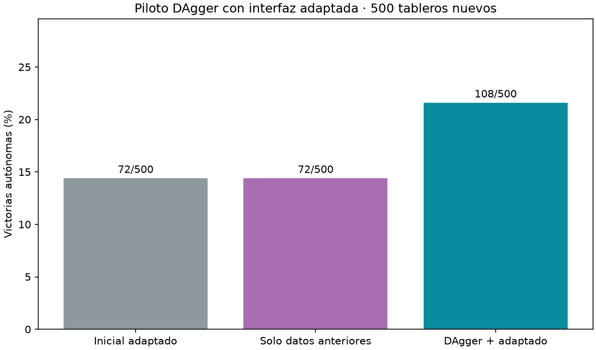

# DAgger con interfaz adaptada: piloto

DAgger−control: **+7.20 puntos**, IC95% condicional [+4.00,+10.40]. Una semilla/un cerebro; no establece consistencia.

| Variante | Victorias | Updates elegidos |
|---|---|---|
| Inicial adaptado | 72/500 (14.4%) | 0 |
| Solo datos anteriores | 72/500 (14.4%) | 0 |
| DAgger + adaptado | 108/500 (21.6%) | 2250 |



Desde interfaz adaptada2750 de20261002,encoder/cerebro congelados y lector entrenable. Adam del lector/RNG conservados;test exacto de unpaso al retirargrupo encoder pasa. Tres rondas300layouts de colección nuevos+750updates,control64originales frente a32originales+32agregadoDAgger uniforme. 4788 posiciones nuevas con acciones seguras certificadas;el agente toma todas las acciones,maestro solo etiqueta. Cache recomputada del encoderadaptado; pérdida de validación inicial coincide con elcheckpoint padre.

Selección por holdout original cada250,incluyeinicial,sellada antes de500layouts finales nuevos7×7/7minas;0 aperturasautomáticas excluidas. Bootstrap10000 remuestreos pareados por tablero,condicional a estos modelos. No comparar directamente con modelos DAgger de otros benchmarks ni interpretar éxito asistido. Sin filtro del maestro al actuar.

Auditoría reconstruye1400layouts únicos,solapamiento previo0,selecciónrecalculada,encoderintacto,teacheracciones0,conteos/hashes/sello intactos. Nuevos datos provienen de colección y nunca del conjunto final. Originales preservados,ningún agenteservido sustituido. Protocolo `research/PROTOCOLO_DAGGER_INTERFAZ_ADAPTADA.md`,artefactos `runs/adapted-dagger-001`.

```json
{
  "results": {
    "baseline": {
      "wins": 72,
      "n": 500,
      "automatic_excluded": 0,
      "selected_step": 0
    },
    "control": {
      "wins": 72,
      "n": 500,
      "automatic_excluded": 0,
      "selected_step": 0
    },
    "dagger": {
      "wins": 108,
      "n": 500,
      "automatic_excluded": 0,
      "selected_step": 2250
    }
  },
  "comparisons": {
    "control": {
      "delta_pp": 7.199999999999999,
      "conditional_ci95_pp": [
        4.0,
        10.4
      ]
    },
    "baseline": {
      "delta_pp": 7.199999999999999,
      "conditional_ci95_pp": [
        4.0,
        10.4
      ]
    }
  },
  "metrics": {
    "baseline": {
      "known_mine_choices": 146,
      "safe_choices": 1943,
      "safe_opportunities": 2341
    },
    "control": {
      "known_mine_choices": 146,
      "safe_choices": 1943,
      "safe_opportunities": 2341
    },
    "dagger": {
      "known_mine_choices": 136,
      "safe_choices": 2337,
      "safe_opportunities": 2668
    }
  },
  "new_positions": 4788,
  "shared_layouts": 500,
  "automatic_excluded": 0
}
```
