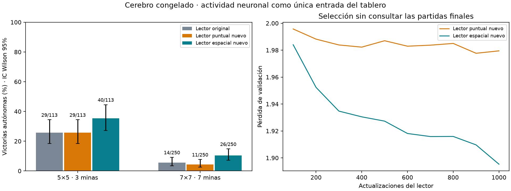

# Decoder espacial con cerebro congelado

Experimento `spatial-decoder-001`, terminado. Entrenamiento exclusivo del lector; checkpoint híbrido y modelo neuronal anterior preservados.

**El lector espacial mejora nominalmente en ambas dificultades y el lector puntual de capacidad comparable no.** Comparación emparejada favorable al espacial: frente al original, 12 victorias exclusivas contra 1 en 5×5, y 18 contra 6 en 7×7. Apoya continuar con lectura espacial; no demuestra superioridad entre semillas o conectomas.



## Evaluación autónoma

Mismas 377 partidas nuevas para las tres políticas: 127 de 5×5 y 250 de 7×7. En 5×5 solo quedaban 127 layouts inéditos de los 2,024 posibles con tres minas y centro seguro; se usaron todos. Se excluyen las victorias que ocurren durante la apertura automática (5×5: 14; 7×7: 0). El maestro no elige acciones; el solver solo mide oportunidades después de que el modelo produce sus puntuaciones. Argmax determinista entre acciones legales.

| Modelo | Dificultad | Victorias excluyendo aperturas | Oportunidades seguras aprovechadas | Elecciones de mina demostrable |
|---|---|---|---|---|
| Lector original | 5×5 | 29/113 (25.7%) | 257/321 | 29 |
| Lector original | 7×7 | 14/250 (5.6%) | 553/757 | 99 |
| Lector puntual nuevo | 5×5 | 29/113 (25.7%) | 254/315 | 29 |
| Lector puntual nuevo | 7×7 | 11/250 (4.4%) | 526/734 | 106 |
| Lector espacial nuevo | 5×5 | 40/113 (35.4%) | 312/364 | 25 |
| Lector espacial nuevo | 7×7 | 26/250 (10.4%) | 828/1044 | 99 |

Las tasas de oportunidades seguras corresponden a las trayectorias de cada política; sus denominadores difieren. No son una comparación sobre los mismos estados ni un win rate corregido por suerte.

Comparación emparejada (mismas posiciones de minas):
```json
{
  "original": {
    "5": {
      "spatial_only": 12,
      "control_only": 1
    },
    "7": {
      "spatial_only": 18,
      "control_only": 6
    }
  },
  "pointwise": {
    "5": {
      "spatial_only": 16,
      "control_only": 5
    },
    "7": {
      "spatial_only": 18,
      "control_only": 3
    }
  }
}
```
`spatial_only`: gana el espacial y pierde el control. `control_only`: lo contrario. Intervalos de la gráfica: Wilson 95% por proporción; no son intervalos de la diferencia emparejada.

## Intervención y control

Encoder, ganancias por neurona y conexión y mapa óptico congelados del checkpoint retina_plastic de 3,000 updates, SHA256 `9dc158b146f65d1cc29afa8eb989efe02ad8a8b2defd7586ac940dbb9a86568e`. Todos los nodos y conexiones originales se conservan. La única información del tablero que recibe el lector es el mapa de actividad de diez tipos neuronales; también recibe tamaño y cantidad pública de minas, como el original. No hay bypass de pistas visibles.

Lector espacial: dos convoluciones 3×3 con 32 canales, tanh y salida 1×1: campo 5×5, 12,769 parámetros. Control puntual nuevo: dos convoluciones 1×1 con 106 canales, tanh y salida 1×1: 12,827 parámetros. Diferencia de capacidad <1%. El control puntual separa acceso espacial de mero aumento de parámetros y presupuesto adicional. El lector original permanece como tercer control sin nuevo entrenamiento.

10,000 posiciones reales de entrenamiento y 1,000 de validación del dataset estructural previo. Se precalculó la actividad congelada una vez; entrenar los lectores no repite la propagación neuronal. Ambos reciben los mismos minibatches equilibrados por tamaño/categoría, 1,000 updates, batch64, Adam lr0.001, clipping5, semilla20261002. Selección por mínima pérdida de validación cada100 pasos, sin usar las partidas finales.

```json
[
  {
    "variant": "pointwise",
    "selected_step": 900,
    "validation_loss": 1.977694465637207,
    "parameters": 12827
  },
  {
    "variant": "spatial",
    "selected_step": 1000,
    "validation_loss": 1.8953465118408204,
    "parameters": 12769
  }
]
```

Partidas finales con layouts excluidos de los datasets previos encontrados en runs/*/dataset.pkl; se guardan seeds y hashes. No se modificaron los datos ni las reglas del juego. La interfaz actual solo soporta 5×5 y 7×7: no se extrapola a tableros grandes.

## Verificación y límites

Tres pruebas del lector pasan: campo receptivo 5×5 frente a 1×1 mediante gradiente, capacidad comparable y roundtrip exacto de pesos. Durante la preparación se verificó reconstrucción del lector original desde la caché en acciones legales (tolerancia1e-5). Hashes de checkpoints protegidos verificados antes y después. Híbrido: `81b09d60395123c0591d8837d2a4419825af51c4a93acb0dbebee31702095ea5`.

Verificación independiente de caché en ambos tamaños: error máximo 0.0 en 5×5 y 0.0 en 7×7. Anulando la actividad antes del lector espacial, las victorias caen a 3/113 y 0/250. Esto comprueba dependencia funcional de la actividad, no ventaja biológica; anularla también cambia la distribución de entrada.

En 5×5 evaluamos el remanente de un universo pequeño casi agotado. No se debe tratar como muestreo nuevo ilimitado del juego ni ajustar más hiperparámetros mirando estos mismos resultados.

Una semilla de entrenamiento y un checkpoint cerebral: resultado piloto, no superioridad general ni ventaja del conectoma. No se publicó ni se sustituyó el agente de la escena automáticamente. Debe distinguirse mejorar un lector sobre actividad de que el cerebro congelado haya aprendido una estrategia nueva.

## Archivos

Resultados por partida: `runs/spatial-decoder-001/*-games.json`. Checkpoints de lectores: `pointwise.pt`, `spatial.pt`; requieren el checkpoint cerebral especificado en el manifiesto. Cachés reutilizables: train.pt/holdout.pt. Progreso e historiales en la misma carpeta. Comandos: `.venv/bin/python -m experiments.train_spatial_decoder` (rechaza sobrescritura), `.venv/bin/python -m experiments.report_spatial_decoder`. Fuentes de la corrida preservadas en source/.
