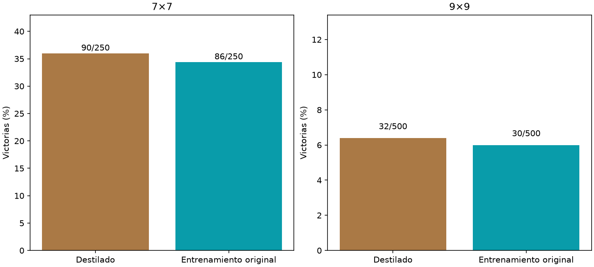

# Destilación de consenso

Principal9×9,destilado−control: +0.40pp,IC95%[-2.20,+3.00].



Mismos lectores nuevos12769param,Adam.001,3000updates y draws de posiciones;encoder ygrafo fijo1ciclo. Destilado mezcla .5CE segura+.5KL(T2) con profesor fijo de4orientaciones;control CEsegura. Profesor preentrenado,mayor cómputo de preparación;ambos alumnos mismos updates. Ambos evaluados con una sola inferencia,750layouts nuevos5009/2507. No selección de endpoint por test. No demuestra ventaja anatómica.

```json
{
  "7": {
    "results": {
      "distilled": {
        "wins": 90,
        "n": 250,
        "safe_choices": 1494,
        "safe_opportunities": 1606,
        "known_mine_choices": 51,
        "death_with_safe_available": 68
      },
      "control": {
        "wins": 86,
        "n": 250,
        "safe_choices": 1526,
        "safe_opportunities": 1666,
        "known_mine_choices": 63,
        "death_with_safe_available": 84
      }
    },
    "distilled_minus_control": {
      "delta_pp": 1.6,
      "ci95_pp": [
        -3.2,
        6.4
      ]
    }
  },
  "9": {
    "results": {
      "distilled": {
        "wins": 32,
        "n": 500,
        "safe_choices": 4140,
        "safe_opportunities": 4653,
        "known_mine_choices": 203,
        "death_with_safe_available": 308
      },
      "control": {
        "wins": 30,
        "n": 500,
        "safe_choices": 3616,
        "safe_opportunities": 4122,
        "known_mine_choices": 170,
        "death_with_safe_available": 277
      }
    },
    "distilled_minus_control": {
      "delta_pp": 0.4,
      "ci95_pp": [
        -2.1999999999999997,
        3.0
      ]
    }
  }
}
```
