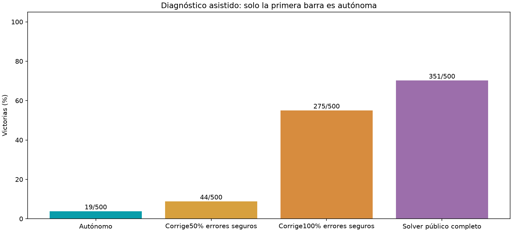

# Diagnóstico de correcciones públicas

**No hubo entrenamiento. Solo el brazo autónomo mide al agente por sí mismo.** Los demás delegan decisiones en reglas externas.



500tableros nuevos9×9/12compartidos,checkpoint fijo,una semilla/un cerebro. Las correcciones parciales solo intervienen cuando la propuesta ignora una segura certificada. Solver completo también decide en incertidumbre con probabilidades exactas o heurísticas según el estado. Las trayectorias divergen: diferencias no son fracciones causales aditivas ni cotas superiores matemáticas. La tasa50%se aplica a errores elegibles y se audita con una moneda fija porseed/paso. Se reconstruyeron todos los estados y acciones para comprobar que decisiones usan únicamente observaciones públicas. Agente servido ypesos intactos;estas victorias asistidas no son aprendizaje ni ventaja anatómica.

```json
{
  "results": {
    "autonomous": {
      "wins": 19,
      "n": 500,
      "assisted": false,
      "clicks": 4111,
      "eligible": 424,
      "corrections": 0,
      "teacher_actions": 0,
      "death_with_safe_available": 282
    },
    "safe_half": {
      "wins": 44,
      "n": 500,
      "assisted": true,
      "clicks": 4560,
      "eligible": 723,
      "corrections": 365,
      "teacher_actions": 365,
      "death_with_safe_available": 251
    },
    "safe_all": {
      "wins": 275,
      "n": 500,
      "assisted": true,
      "clicks": 7221,
      "eligible": 2048,
      "corrections": 2048,
      "teacher_actions": 2048,
      "death_with_safe_available": 0
    },
    "public_solver": {
      "wins": 351,
      "n": 500,
      "assisted": true,
      "clicks": 9462,
      "eligible": 1518,
      "corrections": 7890,
      "teacher_actions": 9462,
      "death_with_safe_available": 0
    }
  },
  "assisted_minus_autonomous": {
    "safe_half": {
      "delta_pp": 5.0,
      "ci95_pp": [
        3.2,
        7.000000000000001
      ]
    },
    "safe_all": {
      "delta_pp": 51.2,
      "ci95_pp": [
        46.800000000000004,
        55.60000000000001
      ]
    },
    "public_solver": {
      "delta_pp": 66.4,
      "ci95_pp": [
        62.0,
        70.6
      ]
    }
  }
}
```
