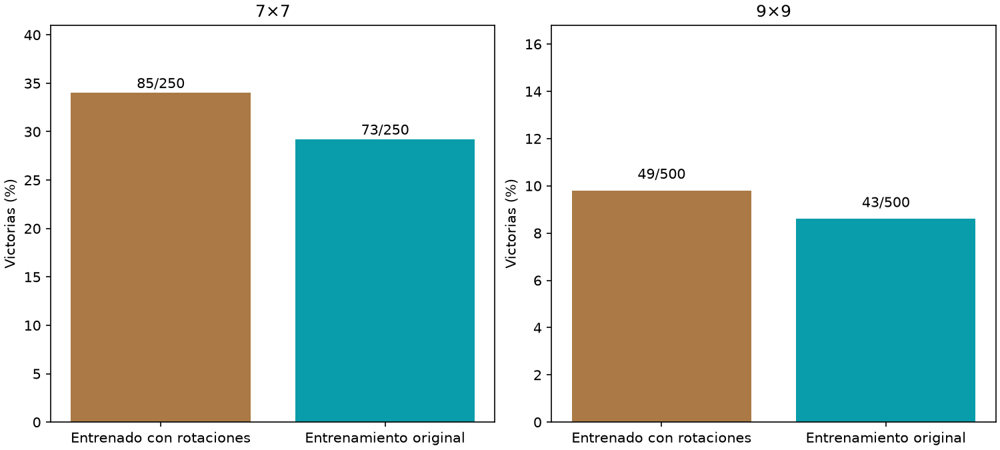

# Entrenamiento con rotaciones

Principal9×9,aumentación−control: +1.20pp,IC95%[-1.60,+4.00].



Mismos lectores nuevos12769param,Adam.001,3000updates y draws de posiciones;encoder ygrafo fijo1ciclo. Aumentado ve una orientación aleatoria por posición,controloriginal;etiquetas/acciones se giran junto con las pistas. Ambos evaluados con una sola inferencia,750layouts nuevos5009/2507. No selección de endpoint por test. No demuestra ventaja anatómica.

```json
{
  "7": {
    "results": {
      "augmented": {
        "wins": 85,
        "n": 250,
        "safe_choices": 1496,
        "safe_opportunities": 1648,
        "known_mine_choices": 60,
        "death_with_safe_available": 85
      },
      "control": {
        "wins": 73,
        "n": 250,
        "safe_choices": 1424,
        "safe_opportunities": 1586,
        "known_mine_choices": 74,
        "death_with_safe_available": 95
      }
    },
    "augmented_minus_control": {
      "delta_pp": 4.8,
      "ci95_pp": [
        -1.2,
        10.8
      ]
    }
  },
  "9": {
    "results": {
      "augmented": {
        "wins": 49,
        "n": 500,
        "safe_choices": 4265,
        "safe_opportunities": 4764,
        "known_mine_choices": 183,
        "death_with_safe_available": 265
      },
      "control": {
        "wins": 43,
        "n": 500,
        "safe_choices": 3933,
        "safe_opportunities": 4427,
        "known_mine_choices": 182,
        "death_with_safe_available": 286
      }
    },
    "augmented_minus_control": {
      "delta_pp": 1.2,
      "ci95_pp": [
        -1.6,
        4.0
      ]
    }
  }
}
```
