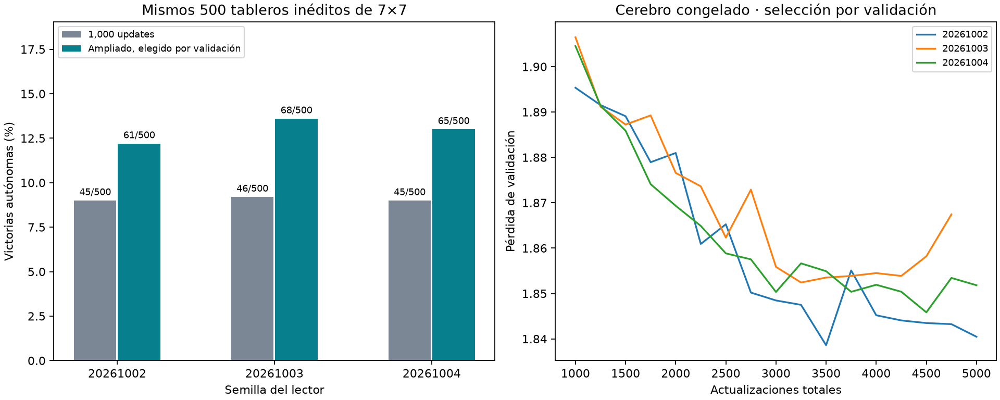

# Ampliación del lector espacial con cerebro congelado

Corrida `spatial-extended-001`, terminada. Se compararon tres continuaciones contra sus respectivos checkpoints de 1,000 actualizaciones en un benchmark nuevo reservado antes de entrenar.

## Resultado autónomo

Promedio entre lectores: **9.07% → 12.93%**, diferencia **+3.87 puntos porcentuales**. Mejoró nominalmente en 3/3 semillas. Intervalo 95% por bootstrap emparejado de tableros: [+1.73, +6.07] pp, condicionado a estos tres lectores.

| Semilla | Update elegido / realizado | Antes (1,000) | Después | Diferencia |
|---|---|---|---|---|
| 20261002 | 3500 / 5000 | 45/500 (9.0%) | 61/500 (12.2%) | +3.2 pp |
| 20261003 | 3250 / 4750 | 46/500 (9.2%) | 68/500 (13.6%) | +4.4 pp |
| 20261004 | 4500 / 5000 | 45/500 (9.0%) | 65/500 (13.0%) | +4.0 pp |



500 layouts 7×7/7 minas nuevos y compartidos por los seis modelos, excluidos de datasets y benchmarks anteriores. 0 aperturas automáticas excluidas; 500 partidas con decisiones. Argmax legal, sin intervención del maestro. Tres lectores sobre los mismos tableros no son 1,500 layouts independientes.

Comparación emparejada por semilla:
```json
[
  {
    "seed": 20261002,
    "before": 45,
    "after": 61,
    "n": 500,
    "difference_pp": 3.2,
    "extended_only": 40,
    "baseline_only": 24
  },
  {
    "seed": 20261003,
    "before": 46,
    "after": 68,
    "n": 500,
    "difference_pp": 4.3999999999999995,
    "extended_only": 44,
    "baseline_only": 22
  },
  {
    "seed": 20261004,
    "before": 45,
    "after": 65,
    "n": 500,
    "difference_pp": 4.0,
    "extended_only": 41,
    "baseline_only": 21
  }
]
```

`extended_only`: gana exclusivamente el ampliado; `baseline_only`: exclusivamente el checkpoint de 1,000. El intervalo se calculó con 10,000 remuestreos de tableros (semilla 20261006), promediando primero las diferencias de los tres lectores dentro de cada tablero; no estima toda la variabilidad entre posibles entrenamientos.

## Protocolo y conservación del estado

Mismo decoder espacial de 12,769 parámetros, mismo encoder/cerebro congelados, mismas 10,000 posiciones reales y 1,000 de validación. Batch 64, Adam lr 0.001, clipping 5, minibatches equilibrados por tamaño/categoría. Máximo 5,000 updates totales. Evaluación de validación cada 250 después de 1,000; parada tras seis comprobaciones sin mejorar al menos 0.0001 respecto al ancla anterior. El mejor checkpoint puede ser el original de 1,000: nunca se fuerza adoptar el último.

Los checkpoints previos no contenían Adam. Para continuar sin reiniciar el optimizador, se reprodujeron exactamente las primeras 1,000 actualizaciones para cada semilla. Se exigió igualdad bit a bit de todos los pesos con el checkpoint anterior antes de avanzar. Las tres reproducciones pasaron. Ahora se guardan último/mejor checkpoint con Adam, generador y número de actualización.

Selección y duración (incluye reconstrucción de 1,000 updates):
```json
[
  {
    "seed": 20261002,
    "chosen_step": 3500,
    "stopped_step": 5000,
    "validation_loss": 1.838608325958252,
    "baseline_validation_loss": 1.8953465118408204,
    "first1000_replay_exact": true,
    "seconds": 80.83164750004653
  },
  {
    "seed": 20261003,
    "chosen_step": 3250,
    "stopped_step": 4750,
    "validation_loss": 1.8524234447479249,
    "baseline_validation_loss": 1.9064737148284912,
    "first1000_replay_exact": true,
    "seconds": 75.62459470902104
  },
  {
    "seed": 20261004,
    "chosen_step": 4500,
    "stopped_step": 5000,
    "validation_loss": 1.8458517417907714,
    "baseline_validation_loss": 1.9045378665924073,
    "first1000_replay_exact": true,
    "seconds": 80.47555916709825
  }
]
```

No se eligieron hiperparámetros, checkpoints ni semillas consultando los resultados finales de juego. Benchmarks anteriores permanecieron fuera de esta selección. Las cachés reducen la fase de entrenamiento a trabajar únicamente sobre actividad neuronal; inferencia usa memoización previamente verificada, sin compartir acciones entre lectores.

## Alcance

Se mide presupuesto adicional del lector sobre un único checkpoint cerebral. El cerebro congelado no aprende nuevos pesos, y la prueba no demuestra superioridad frente a una CNN, rendimiento en 16×16 ni ventaja del cableado biológico. El nivel absoluto de victorias sigue siendo el criterio práctico, además de la mejora relativa.

Archivos originales verificados por SHA256 sin cambios. No se sustituyó el agente servido ni se lanzó otra fase automáticamente. Fuente/checkpoints/historias/resultados por partida en runs/spatial-extended-001/. Reproducción: `.venv/bin/python -m experiments.extend_spatial_decoder` (protege corrida existente) y `.venv/bin/python -m experiments.report_spatial_extended`.
