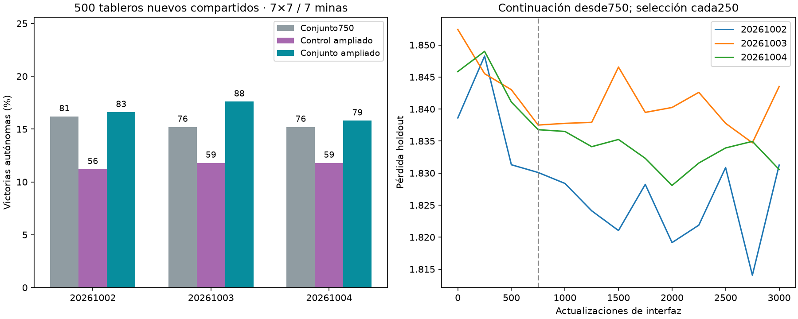

# Extensión de interfaz750→3000

Principal frente a conjunto750: **15.53%→16.67%**, diferencia **+1.13pp**, IC95% condicional [-0.60,+2.80]. Secundario frente a control igualmente ampliado: **+5.07pp**, IC95% [3.0, 7.133333333333333].

| Semilla | Conjunto750 | Control ampliado | Conjunto ampliado | Paso conjunto elegido |
|---|---|---|---|---|
| 20261002 | 81/500 | 56/500 | 83/500 | 2750 |
| 20261003 | 76/500 | 59/500 | 88/500 | 2750 |
| 20261004 | 76/500 | 59/500 | 79/500 | 2000 |



Tres pares reanudados exactamente desde últimos750,pesos/Adam/RNG preservados,2250updates adicionales por brazo. Mejores anteriores conservados en selección. Mismo dataset10000/holdout1000,lr/clipping,batch64/micro16,conectoma y ganancias fijos,sin DAgger adicional. Selección por menor pérdida cada250 sellada antes de500layouts finales nuevos7×7/7minas compartidos. 0 aperturas ganadoras automáticas excluidas. No sustituir agente servido automáticamente.

Los intervalos usan10000 remuestreos pareados por tablero y promedian diferencias entre tres semillas; un cerebro,500tableros compartidos,no1500independientes. No demuestra ventaja anatómica ni compara directamente con DAgger~20% en otros benchmarks. Igual presupuesto de actualizaciones/control,distinto tiempo y parámetros entrenables.

Auditoría independiente reconstruye500layouts,solapamiento0,recalcula selección y coteja historial heredado/registros de restauración,pares de minibatches,duplicados por pesos,conteos,hashes y sello. Gradientes y restauración exacta verificados durante entrenamiento. Artefactos `runs/joint-extended-001` y `runs/joint-extended-SEED`; protocolo `research/PROTOCOLO_EXTENSION_INTERFAZ.md`.

```json
{
  "comparisons": {
    "prior": {
      "reference_mean_pct": 15.533333333333331,
      "joint_mean_pct": 16.666666666666664,
      "delta_pp": 1.1333333333333333,
      "conditional_ci95_pp": [
        -0.6,
        2.8016666666666428
      ]
    },
    "control": {
      "reference_mean_pct": 11.6,
      "joint_mean_pct": 16.666666666666664,
      "delta_pp": 5.066666666666666,
      "conditional_ci95_pp": [
        3.0,
        7.133333333333333
      ]
    }
  },
  "results": {
    "20261002-baseline": {
      "wins": 56,
      "n": 500,
      "automatic_excluded": 0,
      "known_mine_choices": 185,
      "safe_choices": 1885,
      "safe_opportunities": 2312
    },
    "20261002-control": {
      "wins": 56,
      "n": 500,
      "automatic_excluded": 0,
      "known_mine_choices": 185,
      "safe_choices": 1885,
      "safe_opportunities": 2312,
      "duplicate_of": "20261002-baseline"
    },
    "20261002-joint": {
      "wins": 83,
      "n": 500,
      "automatic_excluded": 0,
      "known_mine_choices": 150,
      "safe_choices": 2003,
      "safe_opportunities": 2378
    },
    "20261002-prior": {
      "wins": 81,
      "n": 500,
      "automatic_excluded": 0,
      "known_mine_choices": 161,
      "safe_choices": 2066,
      "safe_opportunities": 2476
    },
    "20261003-baseline": {
      "wins": 59,
      "n": 500,
      "automatic_excluded": 0,
      "known_mine_choices": 173,
      "safe_choices": 1879,
      "safe_opportunities": 2318
    },
    "20261003-control": {
      "wins": 59,
      "n": 500,
      "automatic_excluded": 0,
      "known_mine_choices": 173,
      "safe_choices": 1879,
      "safe_opportunities": 2318,
      "duplicate_of": "20261003-baseline"
    },
    "20261003-joint": {
      "wins": 88,
      "n": 500,
      "automatic_excluded": 0,
      "known_mine_choices": 144,
      "safe_choices": 2054,
      "safe_opportunities": 2413
    },
    "20261003-prior": {
      "wins": 76,
      "n": 500,
      "automatic_excluded": 0,
      "known_mine_choices": 154,
      "safe_choices": 1985,
      "safe_opportunities": 2386
    },
    "20261004-baseline": {
      "wins": 59,
      "n": 500,
      "automatic_excluded": 0,
      "known_mine_choices": 184,
      "safe_choices": 1893,
      "safe_opportunities": 2350
    },
    "20261004-control": {
      "wins": 59,
      "n": 500,
      "automatic_excluded": 0,
      "known_mine_choices": 184,
      "safe_choices": 1893,
      "safe_opportunities": 2350,
      "duplicate_of": "20261004-baseline"
    },
    "20261004-joint": {
      "wins": 79,
      "n": 500,
      "automatic_excluded": 0,
      "known_mine_choices": 153,
      "safe_choices": 1970,
      "safe_opportunities": 2343
    },
    "20261004-prior": {
      "wins": 76,
      "n": 500,
      "automatic_excluded": 0,
      "known_mine_choices": 172,
      "safe_choices": 1989,
      "safe_opportunities": 2420
    }
  },
  "selected_steps": {
    "20261002-baseline": 0,
    "20261002-control": 0,
    "20261002-joint": 2750,
    "20261002-prior": 750,
    "20261003-baseline": 0,
    "20261003-control": 0,
    "20261003-joint": 2750,
    "20261003-prior": 750,
    "20261004-baseline": 0,
    "20261004-control": 0,
    "20261004-joint": 2000,
    "20261004-prior": 750
  },
  "shared_layouts": 500,
  "automatic_excluded": 0
}
```
