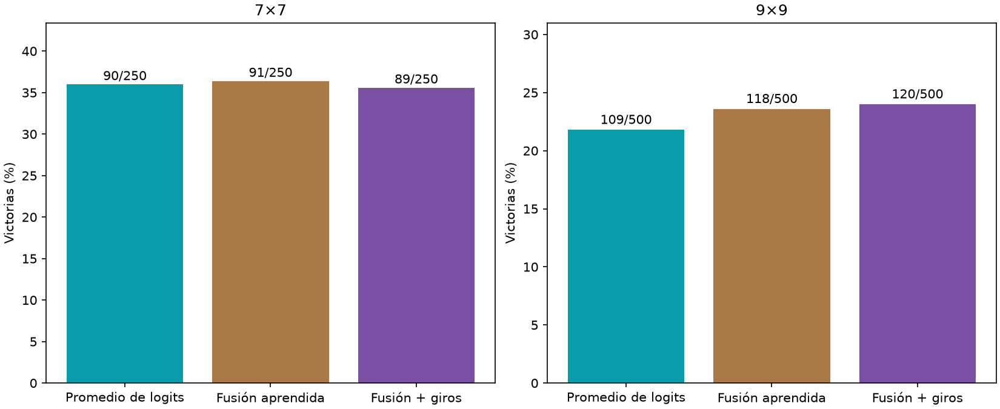

# Fusión aprendida de orientaciones

Principal 9×9, fusión con giros − promedio de logits: +2.20 pp, IC95% [-2.00, +6.40].



Los tres brazos usan cuatro pasadas del cerebro por jugada, el mismo encoder y grafo fijos con 1 ciclo, lectores nuevos, Adam .001, 3000 updates y los mismos draws de posiciones. El promedio entrena un lector de una orientación (12769 parámetros) y promedia logits girados de vuelta; la fusión lee las cuatro actividades alineadas a la vez (12739 parámetros). 750 layouts nuevos 500 de 9×9 y 250 de 7×7. Sin selección de endpoint por test. No demuestra ventaja anatómica.

```json
{
  "7": {
    "results": {
      "mean": {
        "wins": 90,
        "n": 250,
        "safe_choices": 1659,
        "safe_opportunities": 1792,
        "known_mine_choices": 60,
        "death_with_safe_available": 85
      },
      "fusion": {
        "wins": 91,
        "n": 250,
        "safe_choices": 1577,
        "safe_opportunities": 1707,
        "known_mine_choices": 57,
        "death_with_safe_available": 75
      },
      "fusion_aug": {
        "wins": 89,
        "n": 250,
        "safe_choices": 1515,
        "safe_opportunities": 1621,
        "known_mine_choices": 49,
        "death_with_safe_available": 67
      }
    },
    "fusion_minus_mean": {
      "delta_pp": 0.4,
      "ci95_pp": [
        -6.0,
        6.800000000000001
      ]
    },
    "fusion_aug_minus_mean": {
      "delta_pp": -0.4,
      "ci95_pp": [
        -6.800000000000001,
        6.0
      ]
    }
  },
  "9": {
    "results": {
      "mean": {
        "wins": 109,
        "n": 500,
        "safe_choices": 5066,
        "safe_opportunities": 5452,
        "known_mine_choices": 129,
        "death_with_safe_available": 209
      },
      "fusion": {
        "wins": 118,
        "n": 500,
        "safe_choices": 4685,
        "safe_opportunities": 5030,
        "known_mine_choices": 103,
        "death_with_safe_available": 180
      },
      "fusion_aug": {
        "wins": 120,
        "n": 500,
        "safe_choices": 4936,
        "safe_opportunities": 5317,
        "known_mine_choices": 115,
        "death_with_safe_available": 193
      }
    },
    "fusion_minus_mean": {
      "delta_pp": 1.7999999999999998,
      "ci95_pp": [
        -2.4,
        6.0
      ]
    },
    "fusion_aug_minus_mean": {
      "delta_pp": 2.1999999999999997,
      "ci95_pp": [
        -2.0,
        6.4
      ]
    }
  }
}
```
