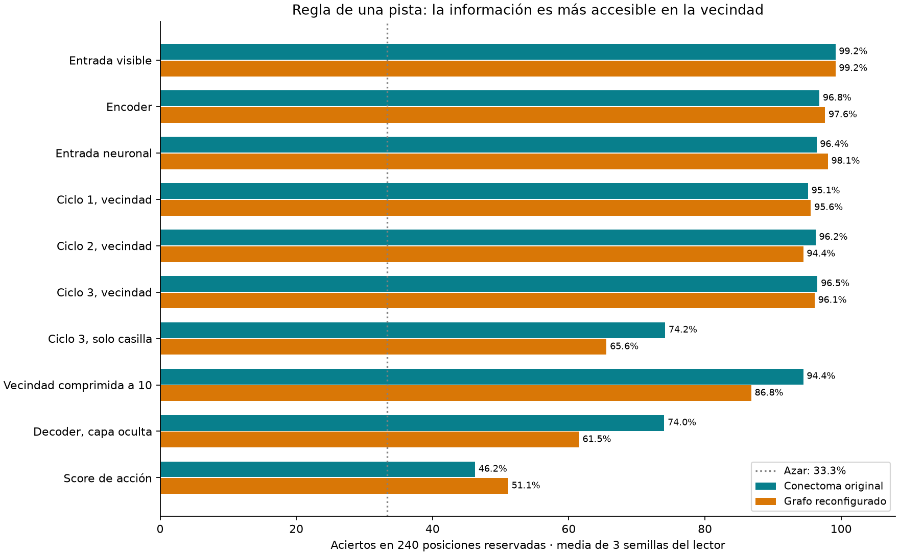

# Diagnóstico de una pista: dónde resulta accesible la información

13 de septiembre de 2026. Corrida independiente terminada: `runs/elementary-probe-001`.

## Resultado

Leyendo la vecindad tras tres ciclos, una pequeña red diagnóstica clasifica correctamente 96.53% de las posiciones. Leyendo solo la actividad de la casilla, 74.17%. Con la vecindad comprimida a diez valores mediante PCA ajustado exclusivamente en entrenamiento, 94.44%. Este último control usa el mismo ancho de entrada y la misma arquitectura del lector que la casilla aislada.

Esto **apoya revisar el acceso espacial del decoder** antes de sustituir toda la dinámica neuronal. No establece pérdida irreversible de información: es información accesible a un lector concreto. No implica que el modelo haya aprendido a jugar mejor: el conectoma está congelado, se entrenaron lectores diagnósticos nuevos.

## Tarea y separación

Tableros 5×5, tres minas, pistas correctas calculadas a partir de posiciones de minas. Se designa una pista interior con dos o tres vecinos ocultos. Clases equilibradas: todos seguros desde esa pista (pista cero); todos minas (pista igual a número de vecinos ocultos); indeterminados **desde esa pista** (pista uno y varios vecinos ocultos). Otras pistas pueden resolver una situación etiquetada aquí como indeterminada. El lector recibe la ubicación de la pista designada mediante la extracción de su vecindad.

Estas son aperturas parciales controladas: **se desactiva conceptualmente la expansión automática de ceros**, por lo que no todas estas observaciones son alcanzables en el entorno actual. Esta tarea mide una regla, no win rate ni detección general de minas. No se usan banderas ni posiciones de minas como entrada.

600 posiciones de entrenamiento, 240 de validación, 240 de prueba; 80 por clase en prueba. Se separan las 84 máscaras posibles de vecinos ocultos en 50/17/17 máscaras antes de generar observaciones. No hay máscaras ni tableros visibles compartidos entre particiones. Las rotaciones/reflejos no se agrupan: no afirmamos generalización a familias de simetría nunca vistas. Las 240 posiciones comparten 17 máscaras reservadas y no deben tratarse como 240 familias independientes.

## Modelos y lectores

Se cargaron los checkpoints de 3,000 actualizaciones de `retina_plastic` y `rewired_plastic`, semilla 20260926. Solo inferencia, sin modificar sus pesos. Extracción en batches de 16 sobre los grafos completos. El score extraído coincide con el forward original: error máximo 9.54e-07 y 2.38e-07 respectivamente.

Lectores MLP con 64 unidades tanh y tres salidas; AdamW, lr 0.003, weight decay 0.01, máximo 600 updates completos. Estandarización ajustada solo en entrenamiento. Selección cada 20 updates por pérdida de validación, nunca por prueba. Tres semillas del lector (0/1/2), **no tres entrenamientos nuevos del conectoma**. La anchura varía según la representación; el control PCA10 permite una comparación de igual anchura con los diez tipos neuronales de una casilla. PCA usa solo entrenamiento y no etiquetas.

| Información disponible para el lector nuevo | Original | Reconfigurado |
|---|---:|---:|
| Entrada visible | 99.17% | 99.17% |
| Encoder | 96.81% | 97.64% |
| Entrada neuronal | 96.39% | 98.06% |
| Ciclo 1, vecindad | 95.14% | 95.56% |
| Ciclo 2, vecindad | 96.25% | 94.44% |
| Ciclo 3, vecindad | 96.53% | 96.11% |
| Ciclo 3, solo casilla | 74.17% | 65.56% |
| Vecindad comprimida a 10 | 94.44% | 86.81% |
| Decoder, capa oculta | 74.03% | 61.53% |
| Score de acción | 46.25% | 51.11% |

CNN pequeña entrenada desde cero para esta tarea, con el mismo parche visible y las mismas particiones: 240/240, 240/240, 240/240. Confirma que el diagnóstico es aprendible por una arquitectura convencional bajo esta separación; no es el checkpoint CNN de partidas completas.

## Interpretación y límites

- La información para esta regla resulta legible tras la propagación: no observamos un derrumbe progresivo entre los ciclos 1 y 3.
- El paso de vecindad a una única casilla reduce la decodificación. La ventaja de PCA10 frente a casilla10 sugiere que importa **qué contexto** recibe el lector, no solo cuántos valores recibe.
- El decoder actual fue entrenado para puntuar acciones, no para clasificar tres estados de una pista. Su score escalar no necesita preservar toda esta clasificación; su baja precisión no es por sí sola una prueba de un bug.
- Los parches se centran en la pista designada; el decoder real puntúa una casilla sin que se le designe una pista. Transferir la mejora a juego completo requiere una intervención y nueva evaluación.
- Ambos grafos conservan información útil; esto no establece superioridad anatómica del conectoma original. Son checkpoints de una sola semilla.
- Una prueba positiva de información accesible tampoco demuestra razonamiento causal ni que el entrenamiento anterior utilizara esa regla.

## Siguiente intervención propuesta

Un lector espacial sobre el mapa de actividad neuronal: para puntuar cada casilla, combinar actividad de su entorno, por ejemplo dos convoluciones 3×3 (campo 5×5). Ese campo puede incluir una pista vecina y todos sus vecinos. No darle directamente las pistas al decoder: mantener la decisión dependiente de actividad del conectoma.

Congelar inicialmente encoder y cerebro, entrenar solo el lector sobre posiciones reales ya disponibles, comparar con el lector actual y evaluar partidas nuevas sin maestro por dificultad. No se lanzó esa intervención en este diagnóstico.

## Reproducibilidad

Scripts: `experiments.elementary_probe`, `experiments.elementary_cnn`, `experiments.elementary_target_probe`, `experiments.verify_elementary`, `experiments.report_elementary`, en ese orden, con `.venv/bin/python -m`. El primer script rechaza sobrescribir corrida completada. Los demás regeneran artefactos derivados. Datos, features, resultados por semilla, verificación y copia de fuentes en la carpeta de corrida. El checkpoint híbrido conserva SHA256 `81b09d60395123c0591d8837d2a4419825af51c4a93acb0dbebee31702095ea5`.
