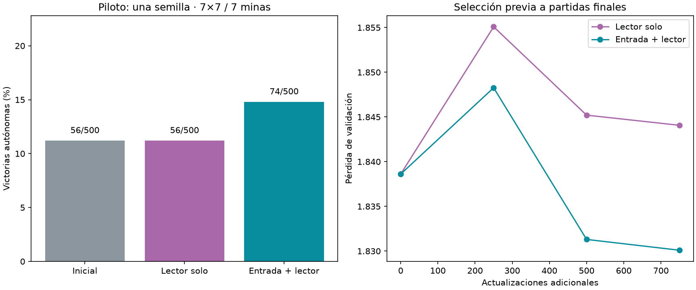

# Entrenamiento conjunto de entrada y lector: piloto

Diferencia conjunto menos control: **+3.60 puntos porcentuales**, IC95% condicional [+1.00,+6.20]. Una semilla; no establece consistencia entre entrenamientos.

| Variante | Victorias autónomas | Updates adicionales elegidos | Clics en minas deducibles |
|---|---|---|---|
| Inicial | 56/500 (11.2%) | 0 | 177 |
| Lector solo | 56/500 (11.2%) | 0 | 177 |
| Entrada + lector | 74/500 (14.8%) | 750 | 154 |



Ambos brazos continúan el mismo lector cerebral elegido en3500updates, con Adam/RNG heredados y los mismos750 minibatches64. Conjunto añade encoder entrenable lr0.0001, lector lr0.001 en ambos. Acumula4microbatches16; clipping5 separado para lector y encoder. Se mantuvieron conexiones, signos, ganancias neuronales, dinámica, mapeo y pooling fijos. Solo control usa caché de actividad para entrenar. Sin nueva experiencia DAgger, mismos10000 ejemplos/1000holdout históricos. Selección mínima pérdida0/250/500/750, incluye inicial; sello previo a prueba final.

500 layouts nuevos compartidos7×7/7minas, 0 aperturas ganadoras automáticas excluidas. Intervalos de10000 remuestreos pareados por tablero, condicionados a una semilla y un cerebro. El control tiene menos parámetros entrenables y menor tiempo de cómputo: igualamos ejemplos/actualizaciones, no tiempo. Maestro no filtra decisiones autónomas. Las métricas por trayectoria tienen denominadores distintos.

Una mejora sería evidencia piloto a favor de adaptar la interfaz actual; no demostraría ventaja anatómica ni superioridad general. Una ausencia de mejora tampoco descartaría otros presupuestos, tasas o lectores. No comparar directamente con las corridas DAgger de~20% ni con otros tableros finales. Ningún modelo servido fue reemplazado.

## Interpretación y siguiente paso

El piloto mejoró de11.2% a14.8% con una diferencia pareada positiva. Apoya seguir investigando la adaptación conjunta de la interfaz; aún requiere repetición en las otras dos semillas antes de considerarla una mejora consistente. El control conservó el punto inicial, mientras que el conjunto eligió750updates. La mejora no prueba una ventaja de la anatomía ni resuelve todavía el desempeño general. No se inició una repetición ni se sustituyó el modelo servido.

## Auditoría y optimización

Ruta autograd de pesos fijos: reutiliza CSR y transpuesta, sin gradientes de aristas. Test de encoder frente a gradiente denso pasa. Grafo real: forward equivalente a ruta previa, gradientes de acumulación equivalentes a minibatch completo, gradiente encoder no nulo, validación inicial online/caché coincide, pesos restaurados producen igual forward con memo. Resto del cerebro intacto; encoder control intacto y conjunto modificado. Auditoría independiente reconstruye500 layouts y verifica solapamiento0, selección, conteos, cambios encoder, sello y hashes originales. Pesos mejores/últimos con Adam/RNG conservados.

```json
{
  "comparisons": {
    "baseline": {
      "joint_minus_reference_pp": 3.5999999999999996,
      "conditional_ci95_pp": [
        1.0,
        6.2
      ]
    },
    "control": {
      "joint_minus_reference_pp": 3.5999999999999996,
      "conditional_ci95_pp": [
        1.0,
        6.2
      ]
    }
  },
  "results": {
    "baseline": {
      "wins": 56,
      "n": 500,
      "automatic_excluded": 0,
      "known_mine_choices": 177,
      "safe_choices": 1817,
      "safe_opportunities": 2224
    },
    "control": {
      "wins": 56,
      "n": 500,
      "automatic_excluded": 0,
      "known_mine_choices": 177,
      "safe_choices": 1817,
      "safe_opportunities": 2224
    },
    "joint": {
      "wins": 74,
      "n": 500,
      "automatic_excluded": 0,
      "known_mine_choices": 154,
      "safe_choices": 1834,
      "safe_opportunities": 2205
    }
  },
  "encoder_change_l2": {
    "best-control": 0.0,
    "latest-control": 0.0,
    "best-joint": 0.35840355412940017,
    "latest-joint": 0.35840355412940017
  },
  "n_shared_games": 500,
  "automatic_excluded": 0
}
```

Protocolo `research/PROTOCOLO_INTERFAZ_CONJUNTA.md`, artefactos `runs/joint-interface-001`.
