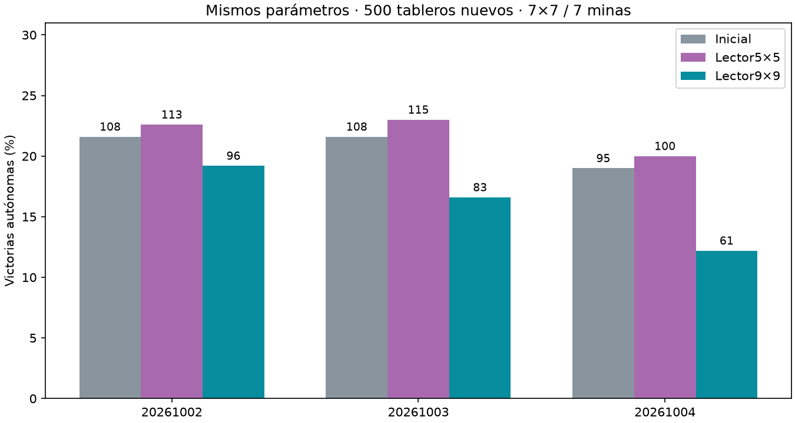

# Lector con campo ampliado:5×5→9×9

Principal: local **21.87%**, amplio **16.00%**, diferencia **-5.87pp**,IC95%condicional [-8.40,-3.47].

| Semilla | Inicial | Local5×5 | Amplio9×9 |
|---|---|---|---|
| 20261002 | 108/500 | 113/500 | 96/500 |
| 20261003 | 108/500 | 115/500 | 83/500 |
| 20261004 | 95/500 | 100/500 | 61/500 |



Trespares desdeDAggeradaptado,1500updatesextra,batch64(32originalesbalanceados+32DAggerheredado),mismosdraws/pesos/Adam/RNGiniciales. Encoder/cerebrofijos. Solo cambia dilation/padding segunda conv1→3,mismos12,769parámetros;test porgradiente valida campos5 y9. Cambia funcióninicial y contexto delosmomentos deAdam heredados,limitación importante. No eslector coninformación omnisciente:campo9noabarca todotablero desdecadaesquina,y activaciones ya mezclan informaciónrecurrencia.

Selección mínima pérdida0/cada250,sellada antes500layoutsfinalesnuevos7×7/7minas;0 aperturasautomáticas excluidas. Sin nuevastrayectorias ni etiquetas. Bootstrap10000 remuestreos por tablero,mediadediferenciasentretressemillas,un cerebro500compartidos,no1500independientes. No comparar absolutos conotrosbenchmarks ni concluir ventaja anatómica.

Auditoría independiente pasa:500layoutsreconstruidos,solapamiento0,batchespareados,selección/dilation/hashes/sello/conteos. Originales y agenteservido intactos. Protocolo `research/PROTOCOLO_LECTOR_AMPLIADO.md`,artefactos `runs/wide-reader-001`.

```json
{
  "comparisons": {
    "local": {
      "reference_mean_pct": 21.866666666666667,
      "wide_mean_pct": 16.0,
      "delta_pp": -5.866666666666666,
      "conditional_ci95_pp": [
        -8.4,
        -3.4666666666666663
      ]
    },
    "baseline": {
      "reference_mean_pct": 20.733333333333334,
      "wide_mean_pct": 16.0,
      "delta_pp": -4.733333333333333,
      "conditional_ci95_pp": [
        -7.266666666666666,
        -2.2666666666666666
      ]
    }
  },
  "results": {
    "20261002-baseline": {
      "wins": 108,
      "n": 500,
      "automatic_excluded": 0,
      "known_mine_choices": 139,
      "safe_choices": 2331,
      "safe_opportunities": 2652
    },
    "20261002-local": {
      "wins": 113,
      "n": 500,
      "automatic_excluded": 0,
      "known_mine_choices": 140,
      "safe_choices": 2445,
      "safe_opportunities": 2791
    },
    "20261002-wide": {
      "wins": 96,
      "n": 500,
      "automatic_excluded": 0,
      "known_mine_choices": 171,
      "safe_choices": 2335,
      "safe_opportunities": 2725
    },
    "20261003-baseline": {
      "wins": 108,
      "n": 500,
      "automatic_excluded": 0,
      "known_mine_choices": 147,
      "safe_choices": 2477,
      "safe_opportunities": 2813
    },
    "20261003-local": {
      "wins": 115,
      "n": 500,
      "automatic_excluded": 0,
      "known_mine_choices": 153,
      "safe_choices": 2475,
      "safe_opportunities": 2846
    },
    "20261003-wide": {
      "wins": 83,
      "n": 500,
      "automatic_excluded": 0,
      "known_mine_choices": 138,
      "safe_choices": 2051,
      "safe_opportunities": 2377
    },
    "20261004-baseline": {
      "wins": 95,
      "n": 500,
      "automatic_excluded": 0,
      "known_mine_choices": 139,
      "safe_choices": 2241,
      "safe_opportunities": 2585
    },
    "20261004-local": {
      "wins": 100,
      "n": 500,
      "automatic_excluded": 0,
      "known_mine_choices": 149,
      "safe_choices": 2466,
      "safe_opportunities": 2806
    },
    "20261004-wide": {
      "wins": 61,
      "n": 500,
      "automatic_excluded": 0,
      "known_mine_choices": 157,
      "safe_choices": 1875,
      "safe_opportunities": 2261
    }
  },
  "selection": {
    "20261002-local": {
      "step": 1250,
      "validation_loss": 1.78419331741333,
      "dilation": 1,
      "sha256": "e25990d0ef52ed7173df5a102085849bdad09c5df514a75123a4f9387a1da46f"
    },
    "20261002-wide": {
      "step": 1500,
      "validation_loss": 1.83383589553833,
      "dilation": 3,
      "sha256": "a3049acae20a401d03e85c13e3ef39137299beae545e839e24c4707b4655833a"
    },
    "20261003-local": {
      "step": 750,
      "validation_loss": 1.8057148838043213,
      "dilation": 1,
      "sha256": "e34cf7c9214ca07bea488f3ebd49c45a9cbb6c9319a13f1e69c07bdf6281247b"
    },
    "20261003-wide": {
      "step": 1500,
      "validation_loss": 1.8342636051177978,
      "dilation": 3,
      "sha256": "f367b8286a273d25ae80755ee418040881d88cdbf21382761f897f521079639f"
    },
    "20261004-local": {
      "step": 1250,
      "validation_loss": 1.7871232929229737,
      "dilation": 1,
      "sha256": "a8ef4889b5653cc5f5c753a557763e7ebf8f9397f5369ef8ee206e11740feb29"
    },
    "20261004-wide": {
      "step": 1500,
      "validation_loss": 1.8362498359680175,
      "dilation": 3,
      "sha256": "b6b540f01ec10ed70b02d7ae5434454b7ca1de42f6aea726e775a8d15cd1a612"
    }
  },
  "shared_layouts": 500,
  "automatic_excluded": 0
}
```
