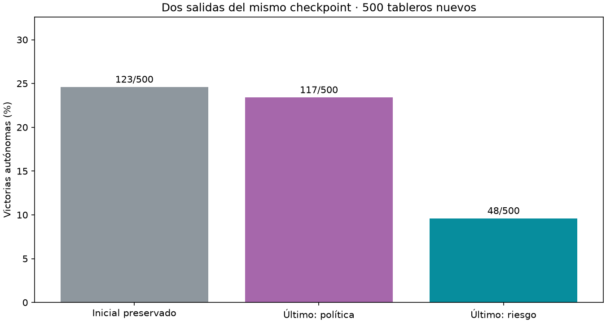

# Decidir por riesgo aprendido

Comparación principal, riesgo menos política del mismo último checkpoint: **-13.80 puntos porcentuales**, IC95% condicional [-17.60, -10.00].

| Salida | Victorias | Clics en minas deducibles |
|---|---|---|
| Inicial preservado | 123/500 (24.6%) | 140 |
| Último: política | 117/500 (23.4%) | 135 |
| Último: riesgo | 48/500 (9.6%) | 137 |



No hubo entrenamiento adicional. Se fijó el último auxiliar1500 antes de la prueba, comparando su salida de política con escoger el menor logit de mina aprendido. Ambos usan idéntico encoder y representación compartida; cambia únicamente la salida que decide. El baseline inicial es una comparación secundaria. No se seleccionaron checkpoints según estas partidas.

No hay filtro ni decisiones del maestro; solo máscara de acciones legales. La salida de riesgo, entrenada con clases balanceadas y sin objetivos para inciertas, no es probabilidad calibrada de mina. El desempeño en casillas inciertas es una limitación central. Test confirma que cambiar la capa final de política no altera la salida de riesgo.

500 layouts nuevos7×7/7minas compartidos, 0 aperturas ganadoras automáticas excluidas. Intervalos de10000 remuestreos pareados por tablero; una semilla/un cerebro, no consistencia entre entrenamientos. Auditoría reconstruye500 layouts y verifica solapamiento0, checkpoint fijo, encoder, hashes y conteos. Originales y agente servido intactos.

Protocolo `research/PROTOCOLO_LECTURA_RIESGO.md`; artefactos `runs/risk-readout-001`.

```json
{
  "results": {
    "baseline": {
      "wins": 123,
      "n": 500,
      "automatic_excluded": 0,
      "known_mine_choices": 140,
      "safe_choices": 2563,
      "safe_opportunities": 2872
    },
    "last_policy": {
      "wins": 117,
      "n": 500,
      "automatic_excluded": 0,
      "known_mine_choices": 135,
      "safe_choices": 2517,
      "safe_opportunities": 2849
    },
    "last_risk": {
      "wins": 48,
      "n": 500,
      "automatic_excluded": 0,
      "known_mine_choices": 137,
      "safe_choices": 926,
      "safe_opportunities": 1645
    }
  },
  "comparisons": {
    "last_policy": {
      "delta_pp": -13.8,
      "conditional_ci95_pp": [
        -17.599999999999998,
        -10.0
      ]
    },
    "baseline": {
      "delta_pp": -15.0,
      "conditional_ci95_pp": [
        -19.0,
        -11.200000000000001
      ]
    }
  },
  "shared_layouts": 500,
  "automatic_excluded": 0
}
```
