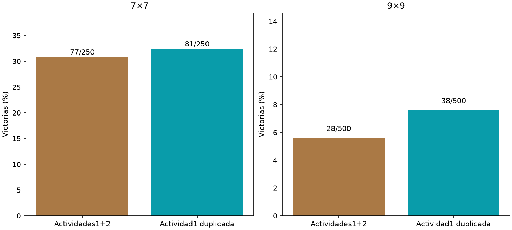

# Lectura de dos tiempos

Principal9×9,combinado−control: -2.00pp,IC95%[-4.40,+0.20].



Ambos usan el grafo cerebral y las mismas10clases de salida,encoder/gains/pesos fijos. Entradas20canales:concatenación1+2frente1+1;amboslectores15649parámetros. Lectores idénticos15649parámetros,misma inicialización nueva,Adam,3000updates ybatches. Encoder fue adaptado a1ciclo en el piloto de interfaz temprana;grafo fijo ysinpistas crudas allector. 750layouts nuevos compartidos5009/2507,una inicialización/un cerebro. No se equiparan ciclosdiscretos con tiempo biológico ni se infiere capacidad máxima. No entran pistas crudas directamente allector. Agente servido intacto.

```json
{
  "7": {
    "results": {
      "combined": {
        "wins": 77,
        "n": 250,
        "safe_choices": 1457,
        "safe_opportunities": 1594,
        "known_mine_choices": 54,
        "death_with_safe_available": 84
      },
      "control": {
        "wins": 81,
        "n": 250,
        "safe_choices": 1478,
        "safe_opportunities": 1631,
        "known_mine_choices": 59,
        "death_with_safe_available": 89
      }
    },
    "combined_minus_control": {
      "delta_pp": -1.6,
      "ci95_pp": [
        -8.0,
        4.3999999999999995
      ]
    }
  },
  "9": {
    "results": {
      "combined": {
        "wins": 28,
        "n": 500,
        "safe_choices": 3488,
        "safe_opportunities": 3936,
        "known_mine_choices": 184,
        "death_with_safe_available": 265
      },
      "control": {
        "wins": 38,
        "n": 500,
        "safe_choices": 3763,
        "safe_opportunities": 4272,
        "known_mine_choices": 194,
        "death_with_safe_available": 286
      }
    },
    "combined_minus_control": {
      "delta_pp": -2.0,
      "ci95_pp": [
        -4.3999999999999995,
        0.2
      ]
    }
  }
}
```
