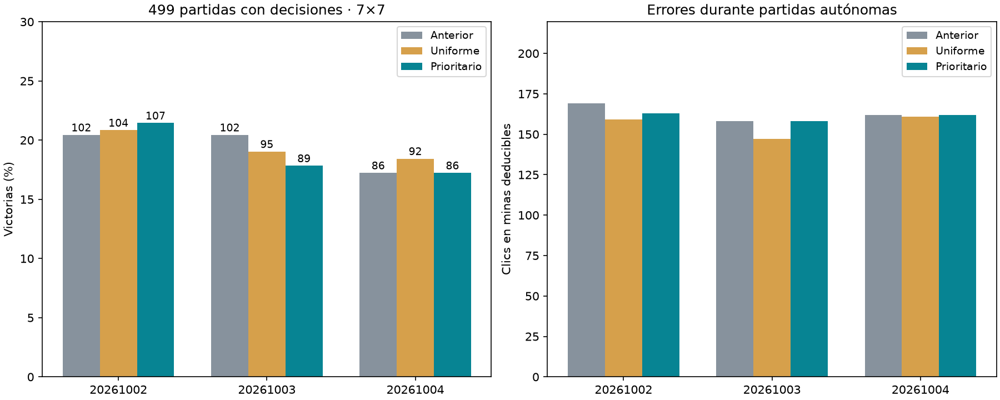

# Priorizar errores de minas deducibles

Esta configuración no mostró mejora reproducible. Media de victorias ajustada por aperturas automáticas: anterior 19.37%, uniforme 19.44%, prioritario 18.84%. Diferencia priorizado−uniforme −0.60 puntos, IC95% condicional [−2.34,+1.14]. No demuestra que toda priorización sea inútil ni una caída estadísticamente estable; no justifica adoptar esta variante.

Se evaluaron 500 layouts nuevos; uno terminó ganado en la apertura central sin decisión del modelo. Se excluye idénticamente en los nueve modelos: los resultados siguientes usan 499 partidas con decisiones. Las cifras de progreso de consola incluían esa victoria automática.

| Semilla | Anterior | Uniforme | Prioritario |
|---|---|---|---|
| 20261002 | 102/499 (20.4%) | 104/499 (20.8%) | 107/499 (21.4%) |
| 20261003 | 102/499 (20.4%) | 95/499 (19.0%) | 89/499 (17.8%) |
| 20261004 | 86/499 (17.2%) | 92/499 (18.4%) | 86/499 (17.2%) |



## Comparación emparejada de victorias

```json
{
  "baseline": {
    "delta_pp": -0.5344021376085505,
    "conditional_ci95_pp": [
      -2.0708082832331334,
      1.002004008016032
    ]
  },
  "control": {
    "delta_pp": -0.6012024048096193,
    "conditional_ci95_pp": [
      -2.338009352037408,
      1.1356045424181695
    ]
  }
}
```

Intervalos bootstrap de 10,000 remuestreos por tablero, promediando primero las diferencias entre lectores en cada tablero. Condicionados a estas tres semillas sobre un único cerebro. Son 499 partidas con decisiones de 500 layouts compartidos, no 1,500 ensayos independientes.

## Ajuste sobre los datos disponibles

```json
{
  "20261002": {
    "control": {
      "initial_known_mines": 683,
      "initial_safe": 12722,
      "positions": 14143,
      "selected_known_mines": 620,
      "selected_safe": 12768,
      "selected_step": 750,
      "prioritized_draws": 0
    },
    "priority": {
      "initial_known_mines": 683,
      "initial_safe": 12722,
      "positions": 14143,
      "selected_known_mines": 630,
      "selected_safe": 12666,
      "selected_step": 500,
      "prioritized_draws": 24000
    }
  },
  "20261003": {
    "control": {
      "initial_known_mines": 480,
      "initial_safe": 9125,
      "positions": 10217,
      "selected_known_mines": 481,
      "selected_safe": 9130,
      "selected_step": 250,
      "prioritized_draws": 0
    },
    "priority": {
      "initial_known_mines": 480,
      "initial_safe": 9125,
      "positions": 10217,
      "selected_known_mines": 415,
      "selected_safe": 9112,
      "selected_step": 1000,
      "prioritized_draws": 24000
    }
  },
  "20261004": {
    "control": {
      "initial_known_mines": 502,
      "initial_safe": 9177,
      "positions": 10277,
      "selected_known_mines": 413,
      "selected_safe": 9326,
      "selected_step": 1250,
      "prioritized_draws": 0
    },
    "priority": {
      "initial_known_mines": 502,
      "initial_safe": 9177,
      "positions": 10277,
      "selected_known_mines": 502,
      "selected_safe": 9177,
      "selected_step": 0,
      "prioritized_draws": 24000
    }
  }
}
```

`initial_known_mines` y `selected_known_mines` miden elecciones de minas certificadas sobre el buffer DAgger, con alternativa segura disponible; no son partidas. `selected_step=0` conserva el modelo anterior. La lista prioritaria se recalcula cada 250 actualizaciones, por lo que puede incluir errores corregidos dentro de ese bloque.

## Ajuste final frente a selección

Los últimos checkpoints prioritarios redujeron las elecciones de mina sobre el buffer frente a los últimos uniformes: 579 vs619, 387 vs490 y381 vs481. Sin embargo, no siempre aumentaron las decisiones seguras totales y no fueron los seleccionados. La selección por pérdida eligió prioridad en pasos500/1000/0; en la tercera semilla conservó el modelo anterior. Los checkpoints uniformes se eligieron en750/250/1250. No se evaluaron las versiones últimas en partidas finales ni se cambió la selección tras observar victorias.

La reducción de errores sobre el buffer no demuestra generalización. En partidas, los modelos prioritarios seleccionados eligieron más minas deducibles que los uniformes en las tres semillas: 163 vs159, 158 vs147 y162 vs161. Una hipótesis pendiente es el desajuste entre selección por pérdida y desempeño autónomo; otra es la distribución de entrenamiento inducida por este porcentaje de prioridad. La prueba no las separa causalmente.

Siguiente propuesta: comparar selección de checkpoints por desempeño autónomo en un conjunto de validación separado, conservando una prueba final nueva. No se inició esa fase ni se sustituyó el agente servido.

## Métricas en partidas

```json
{
  "20261002": {
    "baseline": {
      "wins": 102,
      "n": 499,
      "known_mine_choices": 169,
      "death_with_safe_available": 235,
      "safe_choices": 2594,
      "safe_opportunities": 2968
    },
    "control": {
      "wins": 104,
      "n": 499,
      "known_mine_choices": 159,
      "death_with_safe_available": 217,
      "safe_choices": 2476,
      "safe_opportunities": 2812
    },
    "priority": {
      "wins": 107,
      "n": 499,
      "known_mine_choices": 163,
      "death_with_safe_available": 224,
      "safe_choices": 2544,
      "safe_opportunities": 2908
    }
  },
  "20261003": {
    "baseline": {
      "wins": 102,
      "n": 499,
      "known_mine_choices": 158,
      "death_with_safe_available": 221,
      "safe_choices": 2298,
      "safe_opportunities": 2659
    },
    "control": {
      "wins": 95,
      "n": 499,
      "known_mine_choices": 147,
      "death_with_safe_available": 215,
      "safe_choices": 2189,
      "safe_opportunities": 2529
    },
    "priority": {
      "wins": 89,
      "n": 499,
      "known_mine_choices": 158,
      "death_with_safe_available": 226,
      "safe_choices": 2194,
      "safe_opportunities": 2558
    }
  },
  "20261004": {
    "baseline": {
      "wins": 86,
      "n": 499,
      "known_mine_choices": 162,
      "death_with_safe_available": 228,
      "safe_choices": 2281,
      "safe_opportunities": 2665
    },
    "control": {
      "wins": 92,
      "n": 499,
      "known_mine_choices": 161,
      "death_with_safe_available": 224,
      "safe_choices": 2277,
      "safe_opportunities": 2640
    },
    "priority": {
      "wins": 86,
      "n": 499,
      "known_mine_choices": 162,
      "death_with_safe_available": 228,
      "safe_choices": 2281,
      "safe_opportunities": 2665
    }
  }
}
```

Las políticas recorren posiciones distintas: oportunidades seguras y longitud de partidas pueden cambiar. Los conteos de minas seleccionadas no se interpretan como tasas por clic.

## Protocolo

Mismos datos y presupuesto entre brazos, sin nuevas trayectorias de entrenamiento. Se usan únicamente las rondas de experiencia disponibles para el checkpoint ampliado seleccionado anteriormente. Pesos, Adam y RNG restaurados. Cerebro, encoder, mapa óptico, arquitectura y pérdida uniformemente distribuida sobre jugadas seguras permanecen iguales.

1,500 updates por brazo/semilla, batch 64, Adam lr 0.001, clipping 5. Uniforme: 32 posiciones originales equilibradas por tamaño/categoría +32 uniformes del buffer DAgger. Prioritario: mismas 32 originales +16 uniformes del buffer +16 errores actuales donde el argmax legal elige una mina certificada pese a haber acción segura. Si no hay errores, se vuelve a 32 uniformes. Se recalculan errores cada 250; no hay corrección por importancia: se cambia deliberadamente la distribución de entrenamiento. Certificados obtenidos exclusivamente de observaciones públicas; no se filtran minas durante inferencia.

Selección por pérdida mínima en el holdout original cada 250, incluyendo checkpoint inicial. Los checkpoints finales no se eligen por victorias. Benchmark de 500 layouts nuevos 7×7/7 minas, reservado antes de entrenar, excluido de todos los datasets/benchmarks/colección anteriores. Apertura central segura idéntica. Evaluación autónoma sin maestro.

La prueba del pool de prioridad pasó. Auditoría independiente verificó 34,637 filas de certificados públicos, pools iniciales exactos, separación del benchmark, continuidad de contadores de Adam, doce pares de restauración con siguiente actualización exacta y hashes originales intactos. No se sustituyó agente servido. Fuentes, hashes, certificados por casilla, listas de errores por actualización, checkpoints con Adam/RNG y resultados por partida conservados. Las métricas de ajuste no demuestran generalización ni ventaja anatómica; el contraste importante es con muestreo uniforme a igual presupuesto.
