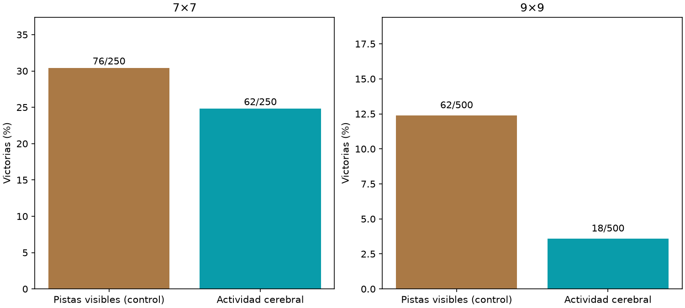

# Comparación de entradas con datos9×9

Principal9×9, pistas−actividad: +8.80pp,IC95%[+5.60,+12.20].



Mismo lector12,769parámetros,idéntica inicialización fresca yAdam,3000updates ybatchesidénticos,CEuniforme. Datos actuales5/7/9,encoder/grafofijos delparentadaptado9. Solo cambia representación recibida. El control de pistas NOusa elcerebro y no se le atribuye hacerlo;no recibe minas ocultas. Presupuestolectorigual,nohistor ialtotal:elbrazo cerebral usa representaciónpreentrenada. 750layouts nuevos compartidos5009/2507,unainicialización/un cerebro. No demuestra imposibilidad biológica ni rendimiento máximo de otroslectores. Agente servido ycheckpoints históricos preservados.

```json
{
  "7": {
    "results": {
      "raw": {
        "wins": 76,
        "n": 250,
        "safe_choices": 1349,
        "safe_opportunities": 1492,
        "known_mine_choices": 57,
        "death_with_safe_available": 83
      },
      "brain": {
        "wins": 62,
        "n": 250,
        "safe_choices": 1281,
        "safe_opportunities": 1441,
        "known_mine_choices": 81,
        "death_with_safe_available": 109
      }
    },
    "raw_minus_brain": {
      "delta_pp": 5.6000000000000005,
      "ci95_pp": [
        -1.2,
        12.4
      ]
    }
  },
  "9": {
    "results": {
      "raw": {
        "wins": 62,
        "n": 500,
        "safe_choices": 3560,
        "safe_opportunities": 4068,
        "known_mine_choices": 161,
        "death_with_safe_available": 264
      },
      "brain": {
        "wins": 18,
        "n": 500,
        "safe_choices": 2910,
        "safe_opportunities": 3400,
        "known_mine_choices": 198,
        "death_with_safe_available": 294
      }
    },
    "raw_minus_brain": {
      "delta_pp": 8.799999999999999,
      "ci95_pp": [
        5.6000000000000005,
        12.2
      ]
    }
  }
}
```
