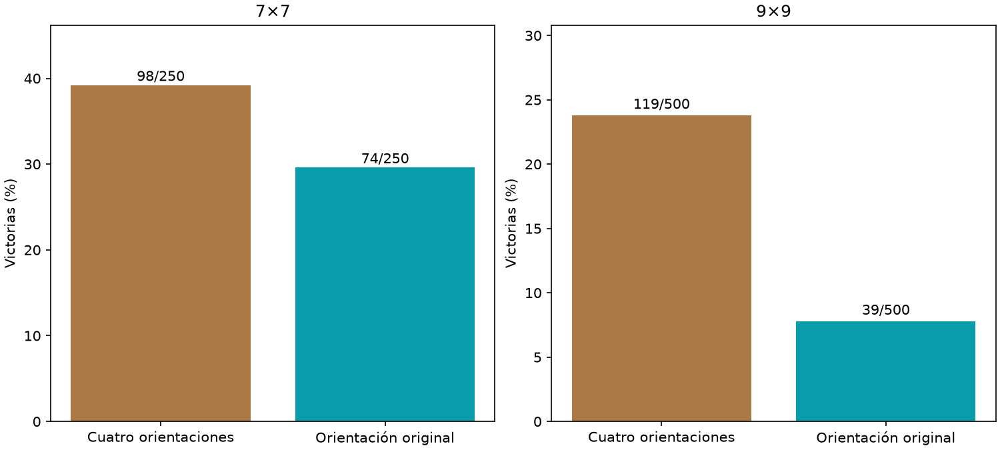

# Agregación de orientaciones

Principal9×9,rotaciones−identidad: +16.00pp,IC95%[+12.40,+19.80].



Mismo modelo fijo de interfaz temprana,1ciclo. Cuatro orientaciones por decisión,logits inversamente rotados y promediados. Sin nuevos updates ni maestro;cuatro veces inferencia nominal,no presupuesto igualado. 750layouts nuevos compartidos,5009/2507. No demuestra aprendizaje ni ventaja anatómica.

```json
{
  "7": {
    "results": {
      "rotated": {
        "wins": 98,
        "n": 250,
        "safe_choices": 1597,
        "safe_opportunities": 1680,
        "known_mine_choices": 37,
        "death_with_safe_available": 55
      },
      "identity": {
        "wins": 74,
        "n": 250,
        "safe_choices": 1377,
        "safe_opportunities": 1495,
        "known_mine_choices": 57,
        "death_with_safe_available": 75
      }
    },
    "rotated_minus_identity": {
      "delta_pp": 9.6,
      "ci95_pp": [
        3.2,
        16.0
      ]
    }
  },
  "9": {
    "results": {
      "rotated": {
        "wins": 119,
        "n": 500,
        "safe_choices": 4968,
        "safe_opportunities": 5300,
        "known_mine_choices": 122,
        "death_with_safe_available": 175
      },
      "identity": {
        "wins": 39,
        "n": 500,
        "safe_choices": 3881,
        "safe_opportunities": 4364,
        "known_mine_choices": 198,
        "death_with_safe_available": 289
      }
    },
    "rotated_minus_identity": {
      "delta_pp": 16.0,
      "ci95_pp": [
        12.4,
        19.8
      ]
    }
  }
}
```
