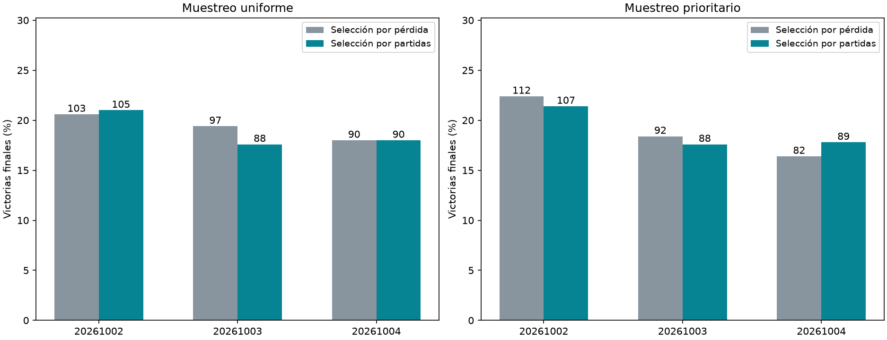

# Selección de checkpoints por partidas de validación

La selección por partidas no mostró una mejora consistente en esta prueba: media final 18.90% frente a 19.20% por pérdida, diferencia −0.30 puntos porcentuales e IC95% condicional [−1.50,+0.87]. Mejoró dos comparaciones, empeoró tres y empató una. No justifica sustituir el criterio anterior; tampoco demuestra que la pérdida sea óptima ni descarta otros diseños de validación.

Se comparan dos reglas usando checkpoints existentes: mínimo de pérdida original frente a máximo de victorias autónomas en un nuevo conjunto de validación. No se entrenó ningún peso. El conjunto final es distinto del de selección y de todos los anteriores.

| Brazo | Elegido por pérdida (update) | Elegido por partidas (update) | Final: pérdida | Final: partidas |
|---|---|---|---|---|
| 20261002-control | 20261002-control-best (750) | 20261002-control-latest (1500) | 103/500 | 105/500 |
| 20261002-priority | 20261002-priority-best (500) | 20261002-priority-latest (1500) | 112/500 | 107/500 |
| 20261003-control | 20261003-control-best (250) | 20261003-baseline (0) | 97/500 | 88/500 |
| 20261003-priority | 20261003-priority-best (1000) | 20261003-baseline (0) | 92/500 | 88/500 |
| 20261004-control | 20261004-control-best (1250) | 20261004-control-best (1250) | 90/500 | 90/500 |
| 20261004-priority | 20261004-priority-best (0) | 20261004-priority-latest (1500) | 82/500 | 89/500 |



## Diferencias emparejadas finales

```json
{
  "control": {
    "mean_delta_pp": -0.4666666666666666,
    "conditional_ci95_pp": [
      -1.8666666666666665,
      0.9333333333333332
    ],
    "loss_mean_pct": 19.333333333333336,
    "game_mean_pct": 18.866666666666667
  },
  "priority": {
    "mean_delta_pp": -0.1333333333333334,
    "conditional_ci95_pp": [
      -2.0,
      1.6
    ],
    "loss_mean_pct": 19.066666666666666,
    "game_mean_pct": 18.933333333333337
  },
  "all": {
    "mean_delta_pp": -0.3000000000000001,
    "conditional_ci95_pp": [
      -1.4999999999999998,
      0.8666666666666668
    ],
    "loss_mean_pct": 19.2,
    "game_mean_pct": 18.9
  }
}
```

Intervalos de 10,000 remuestreos por tablero, promediando diferencias dentro de cada tablero entre las tres semillas del brazo (o los seis casos para `all`). Condicionados a estos lectores, no a todos los entrenamientos posibles. Los dos brazos comparten modelos iniciales y un cerebro; no son seis cerebros independientes. Hay 500 layouts finales compartidos, 0 aperturas ganadoras automáticas excluidas, y 500 partidas con decisiones.

## Qué se seleccionó y qué significa

Cada brazo tiene tres candidatos disponibles: modelo anterior, mejor por pérdida guardado y último guardado. No se recuperaron checkpoints intermedios inexistentes ni se reentrenó. Si dos candidatos tienen pesos idénticos, comparten evaluación exacta. La regla por partidas maximiza victorias en 500 layouts de validación; desempata por menos actualizaciones adicionales y luego orden fijo. Se excluyen aperturas ganadoras automáticas idénticamente entre modelos.

Las elecciones de los seis brazos se guardaron y sellaron antes de evaluar otros 500 layouts finales nuevos. No se consultaron esos resultados finales para escoger ni se evaluaron allí candidatos descartados para retocar la elección. La comparación por pérdida conserva el checkpoint de la fase anterior; el nuevo criterio se compara dentro de ese mismo brazo, no eligiendo además un algoritmo ganador.

Un mejor porcentaje en validación puede deberse parcialmente a selección sobre ruido. La mejora que importa es la del conjunto final independiente. Esta prueba mide una selección entre tres checkpoints disponibles, no prueba que el entrenamiento ni la representación cerebral se hayan arreglado.

## Métricas por elección

```json
{
  "20261002-control": {
    "loss": {
      "candidate": "20261002-control-best",
      "step": 750,
      "wins": 103,
      "n": 500,
      "validation_wins": 97,
      "validation_n": 500,
      "known_mine_choices": 160,
      "death_with_safe_available": 218,
      "safe_choices": 2368,
      "safe_opportunities": 2702
    },
    "games": {
      "candidate": "20261002-control-latest",
      "step": 1500,
      "wins": 105,
      "n": 500,
      "validation_wins": 107,
      "validation_n": 500,
      "known_mine_choices": 163,
      "death_with_safe_available": 223,
      "safe_choices": 2482,
      "safe_opportunities": 2828
    },
    "baseline": {
      "candidate": "20261002-baseline",
      "step": 0,
      "wins": 92,
      "n": 500,
      "validation_wins": 102,
      "validation_n": 500,
      "known_mine_choices": 169,
      "death_with_safe_available": 233,
      "safe_choices": 2266,
      "safe_opportunities": 2602
    }
  },
  "20261002-priority": {
    "loss": {
      "candidate": "20261002-priority-best",
      "step": 500,
      "wins": 112,
      "n": 500,
      "validation_wins": 103,
      "validation_n": 500,
      "known_mine_choices": 163,
      "death_with_safe_available": 221,
      "safe_choices": 2411,
      "safe_opportunities": 2767
    },
    "games": {
      "candidate": "20261002-priority-latest",
      "step": 1500,
      "wins": 107,
      "n": 500,
      "validation_wins": 105,
      "validation_n": 500,
      "known_mine_choices": 164,
      "death_with_safe_available": 228,
      "safe_choices": 2400,
      "safe_opportunities": 2761
    },
    "baseline": {
      "candidate": "20261002-baseline",
      "step": 0,
      "wins": 92,
      "n": 500,
      "validation_wins": 102,
      "validation_n": 500,
      "known_mine_choices": 169,
      "death_with_safe_available": 233,
      "safe_choices": 2266,
      "safe_opportunities": 2602
    }
  },
  "20261003-control": {
    "loss": {
      "candidate": "20261003-control-best",
      "step": 250,
      "wins": 97,
      "n": 500,
      "validation_wins": 98,
      "validation_n": 500,
      "known_mine_choices": 171,
      "death_with_safe_available": 223,
      "safe_choices": 2343,
      "safe_opportunities": 2660
    },
    "games": {
      "candidate": "20261003-baseline",
      "step": 0,
      "wins": 88,
      "n": 500,
      "validation_wins": 103,
      "validation_n": 500,
      "known_mine_choices": 189,
      "death_with_safe_available": 240,
      "safe_choices": 2316,
      "safe_opportunities": 2682
    },
    "baseline": {
      "candidate": "20261003-baseline",
      "step": 0,
      "wins": 88,
      "n": 500,
      "validation_wins": 103,
      "validation_n": 500,
      "known_mine_choices": 189,
      "death_with_safe_available": 240,
      "safe_choices": 2316,
      "safe_opportunities": 2682
    }
  },
  "20261003-priority": {
    "loss": {
      "candidate": "20261003-priority-best",
      "step": 1000,
      "wins": 92,
      "n": 500,
      "validation_wins": 96,
      "validation_n": 500,
      "known_mine_choices": 166,
      "death_with_safe_available": 231,
      "safe_choices": 2148,
      "safe_opportunities": 2496
    },
    "games": {
      "candidate": "20261003-baseline",
      "step": 0,
      "wins": 88,
      "n": 500,
      "validation_wins": 103,
      "validation_n": 500,
      "known_mine_choices": 189,
      "death_with_safe_available": 240,
      "safe_choices": 2316,
      "safe_opportunities": 2682
    },
    "baseline": {
      "candidate": "20261003-baseline",
      "step": 0,
      "wins": 88,
      "n": 500,
      "validation_wins": 103,
      "validation_n": 500,
      "known_mine_choices": 189,
      "death_with_safe_available": 240,
      "safe_choices": 2316,
      "safe_opportunities": 2682
    }
  },
  "20261004-control": {
    "loss": {
      "candidate": "20261004-control-best",
      "step": 1250,
      "wins": 90,
      "n": 500,
      "validation_wins": 92,
      "validation_n": 500,
      "known_mine_choices": 172,
      "death_with_safe_available": 247,
      "safe_choices": 2285,
      "safe_opportunities": 2662
    },
    "games": {
      "candidate": "20261004-control-best",
      "step": 1250,
      "wins": 90,
      "n": 500,
      "validation_wins": 92,
      "validation_n": 500,
      "known_mine_choices": 172,
      "death_with_safe_available": 247,
      "safe_choices": 2285,
      "safe_opportunities": 2662
    },
    "baseline": {
      "candidate": "20261004-baseline",
      "step": 0,
      "wins": 82,
      "n": 500,
      "validation_wins": 90,
      "validation_n": 500,
      "known_mine_choices": 171,
      "death_with_safe_available": 244,
      "safe_choices": 2177,
      "safe_opportunities": 2540
    }
  },
  "20261004-priority": {
    "loss": {
      "candidate": "20261004-priority-best",
      "step": 0,
      "wins": 82,
      "n": 500,
      "validation_wins": 90,
      "validation_n": 500,
      "known_mine_choices": 171,
      "death_with_safe_available": 244,
      "safe_choices": 2177,
      "safe_opportunities": 2540
    },
    "games": {
      "candidate": "20261004-priority-latest",
      "step": 1500,
      "wins": 89,
      "n": 500,
      "validation_wins": 91,
      "validation_n": 500,
      "known_mine_choices": 156,
      "death_with_safe_available": 227,
      "safe_choices": 2054,
      "safe_opportunities": 2434
    },
    "baseline": {
      "candidate": "20261004-baseline",
      "step": 0,
      "wins": 82,
      "n": 500,
      "validation_wins": 90,
      "validation_n": 500,
      "known_mine_choices": 171,
      "death_with_safe_available": 244,
      "safe_choices": 2177,
      "safe_opportunities": 2540
    }
  }
}
```

`validation_wins` corresponde al conjunto de selección; `wins` al conjunto final. No mezclar sus porcentajes. Las métricas de minas conocidas y alternativas seguras describen trayectorias distintas, con denominadores variables.

Protocolo research/PROTOCOLO_SELECCION_POR_PARTIDAS.md. Fuentes, hashes, candidatos, resultados individuales y sello en runs/game-selection-001. La prueba de selección verificó victorias y desempates. Auditoría independiente reconstruyó los 1,000 layouts, comprobó ausencia de solapamientos, recalculó las seis elecciones, cotejó conteos por partida y pesos deduplicados, y verificó el sello y los hashes originales. Se evaluaron 14 conjuntos de pesos distintos en validación y 11 en prueba final. No se modificaron checkpoints ni se sustituyó el agente servido.
