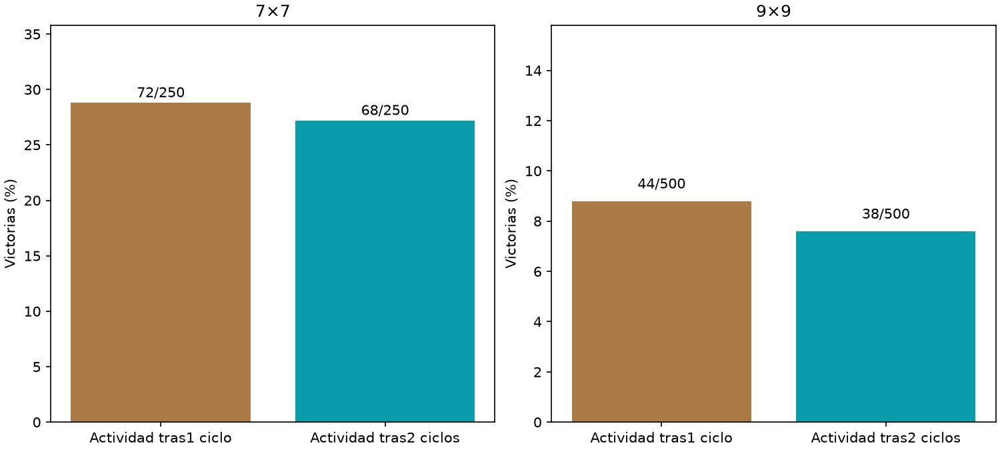

# Propagación con interfaz adaptada

Principal9×9,1ciclo−2ciclos: +1.20pp,IC95%[-1.60,+4.00].



Ambos usan el grafo cerebral y las mismas10clases de salida,encoder/gains/pesos fijos. Solo varían pasos de propagación antes de extraer actividad:1vs2. Lectores idénticos12769parámetros,misma inicialización nueva,Adam,3000updates ybatches. Encoder fue adaptado a1ciclo en el piloto de interfaz temprana;esta asimetría limita la interpretación. 750layouts nuevos compartidos5009/2507,una inicialización/un cerebro. No se equiparan ciclosdiscretos con tiempo biológico ni se infiere capacidad máxima. No entran pistas crudas directamente allector. Agente servido intacto.

```json
{
  "7": {
    "results": {
      "early": {
        "wins": 72,
        "n": 250,
        "safe_choices": 1339,
        "safe_opportunities": 1470,
        "known_mine_choices": 58,
        "death_with_safe_available": 86
      },
      "late": {
        "wins": 68,
        "n": 250,
        "safe_choices": 1264,
        "safe_opportunities": 1414,
        "known_mine_choices": 57,
        "death_with_safe_available": 90
      }
    },
    "early_minus_late": {
      "delta_pp": 1.6,
      "ci95_pp": [
        -4.0,
        7.199999999999999
      ]
    }
  },
  "9": {
    "results": {
      "early": {
        "wins": 44,
        "n": 500,
        "safe_choices": 3812,
        "safe_opportunities": 4265,
        "known_mine_choices": 185,
        "death_with_safe_available": 278
      },
      "late": {
        "wins": 38,
        "n": 500,
        "safe_choices": 3496,
        "safe_opportunities": 3961,
        "known_mine_choices": 189,
        "death_with_safe_available": 267
      }
    },
    "early_minus_late": {
      "delta_pp": 1.2,
      "ci95_pp": [
        -1.6,
        4.0
      ]
    }
  }
}
```
