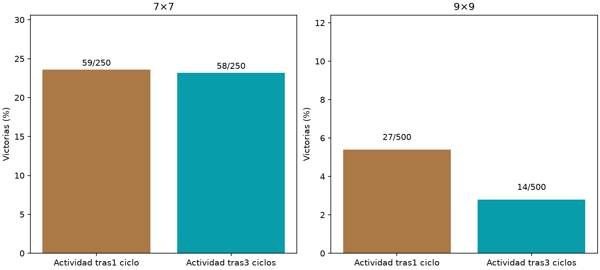

# Lectura temprana frente a tardía

Principal9×9,1ciclo−3ciclos: +2.60pp,IC95%[+0.20,+5.00].



Ambos usan el grafo cerebral y las mismas10clases de salida,encoder/gains/pesos fijos. Solo varían pasos de propagación antes de extraer actividad:1vs3. Lectores idénticos12769parámetros,misma inicialización nueva,Adam,3000updates ybatches. Encoder fue adaptado históricamente a3ciclos;esta asimetría limita la interpretación. 750layouts nuevos compartidos5009/2507,una inicialización/un cerebro. No se equiparan ciclosdiscretos con tiempo biológico ni se infiere capacidad máxima. No entran pistas crudas directamente allector. Agente servido intacto.

```json
{
  "7": {
    "results": {
      "early": {
        "wins": 59,
        "n": 250,
        "safe_choices": 1369,
        "safe_opportunities": 1514,
        "known_mine_choices": 74,
        "death_with_safe_available": 97
      },
      "late": {
        "wins": 58,
        "n": 250,
        "safe_choices": 1374,
        "safe_opportunities": 1538,
        "known_mine_choices": 69,
        "death_with_safe_available": 104
      }
    },
    "early_minus_late": {
      "delta_pp": 0.4,
      "ci95_pp": [
        -5.2,
        6.0
      ]
    }
  },
  "9": {
    "results": {
      "early": {
        "wins": 27,
        "n": 500,
        "safe_choices": 3680,
        "safe_opportunities": 4173,
        "known_mine_choices": 194,
        "death_with_safe_available": 285
      },
      "late": {
        "wins": 14,
        "n": 500,
        "safe_choices": 3176,
        "safe_opportunities": 3720,
        "known_mine_choices": 228,
        "death_with_safe_available": 311
      }
    },
    "early_minus_late": {
      "delta_pp": 2.6,
      "ci95_pp": [
        0.2,
        5.0
      ]
    }
  }
}
```
