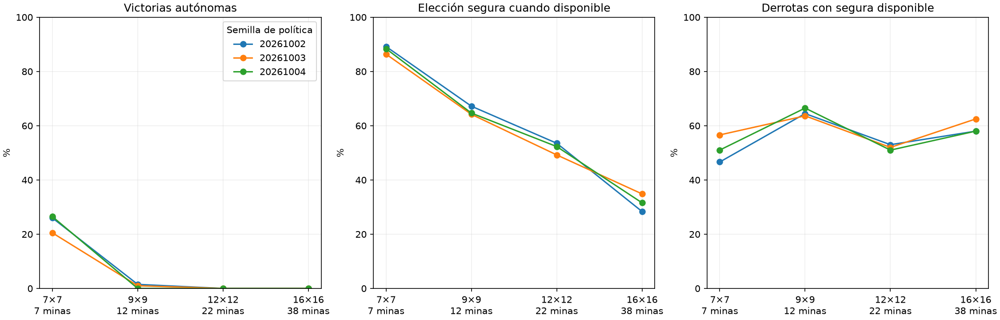

# Evaluación por dificultad

Mapeo ampliado explícitamente a 9/12/16, con igualdad exacta del mapeo histórico 5/7. No hubo entrenamiento con tableros grandes: mide transferencia con una interfaz ampliada. 

| Tablero/minas | Victorias por política (02 / 03 / 04) | Media e IC95% condicional |
|---|---|---|
| 7×7/7 | 52/200 / 41/200 / 53/200 | 24.3% [19.7, 29.3] |
| 9×9/12 | 3/200 / 2/200 / 0/200 | 0.8% [0.2, 1.8] |
| 12×12/22 | 0/200 / 0/200 / 0/200 | 0.0% [0.0, 0.0] |
| 16×16/38 | 0/200 / 0/200 / 0/200 | 0.0% [0.0, 0.0] |



Políticas fijadas antes del test, sin entrenamiento ni intervención del maestro. 800 layouts nuevos, 200 por tamaño, compartidos por tres políticas sobre un cerebro. Victorias automáticas excluidas; el denominador se muestra por política. El intervalo remuestrea layouts conjuntamente entre políticas; no mide variabilidad entre cerebros. Con cero victorias el bootstrap es degenerado [0,0] y no demuestra probabilidad verdadera cero. Densidad cercana a 15%, tamaños y número de minas cambian juntos. El solver solo certifica un subconjunto de lo deducible. Las derrotas tras riesgo exacto de 50% se cuentan aparte y no se convierten en victorias.

Auditoría de identidades, separación de layouts, conteos y hashes completada. No se cambiaron checkpoints ni agente servido.

```json
{
  "7": {
    "mines": 7,
    "per_seed": {
      "20261002": {
        "safe_choices": 965,
        "safe_opportunities": 1082,
        "known_mine_choices": 50,
        "death_with_safe_available": 69,
        "death_after_exact_half_min_risk": 0,
        "wins": 52,
        "n": 200,
        "automatic_excluded": 0,
        "missed_safe_choices": 117
      },
      "20261003": {
        "safe_choices": 831,
        "safe_opportunities": 962,
        "known_mine_choices": 58,
        "death_with_safe_available": 90,
        "death_after_exact_half_min_risk": 1,
        "wins": 41,
        "n": 200,
        "automatic_excluded": 0,
        "missed_safe_choices": 131
      },
      "20261004": {
        "safe_choices": 982,
        "safe_opportunities": 1111,
        "known_mine_choices": 50,
        "death_with_safe_available": 75,
        "death_after_exact_half_min_risk": 1,
        "wins": 53,
        "n": 200,
        "automatic_excluded": 0,
        "missed_safe_choices": 129
      }
    },
    "mean_win_percent": 24.333333333333336,
    "conditional_ci95_percent": [
      19.666666666666664,
      29.33333333333333
    ]
  },
  "9": {
    "mines": 12,
    "per_seed": {
      "20261002": {
        "safe_choices": 551,
        "safe_opportunities": 820,
        "known_mine_choices": 79,
        "death_with_safe_available": 127,
        "death_after_exact_half_min_risk": 0,
        "wins": 3,
        "n": 200,
        "automatic_excluded": 0,
        "missed_safe_choices": 269
      },
      "20261003": {
        "safe_choices": 459,
        "safe_opportunities": 715,
        "known_mine_choices": 77,
        "death_with_safe_available": 126,
        "death_after_exact_half_min_risk": 0,
        "wins": 2,
        "n": 200,
        "automatic_excluded": 0,
        "missed_safe_choices": 256
      },
      "20261004": {
        "safe_choices": 481,
        "safe_opportunities": 744,
        "known_mine_choices": 81,
        "death_with_safe_available": 133,
        "death_after_exact_half_min_risk": 0,
        "wins": 0,
        "n": 200,
        "automatic_excluded": 0,
        "missed_safe_choices": 263
      }
    },
    "mean_win_percent": 0.8333333333333334,
    "conditional_ci95_percent": [
      0.16666666666666666,
      1.833333333333333
    ]
  },
  "12": {
    "mines": 22,
    "per_seed": {
      "20261002": {
        "safe_choices": 273,
        "safe_opportunities": 510,
        "known_mine_choices": 61,
        "death_with_safe_available": 106,
        "death_after_exact_half_min_risk": 0,
        "wins": 0,
        "n": 200,
        "automatic_excluded": 0,
        "missed_safe_choices": 237
      },
      "20261003": {
        "safe_choices": 223,
        "safe_opportunities": 453,
        "known_mine_choices": 54,
        "death_with_safe_available": 104,
        "death_after_exact_half_min_risk": 0,
        "wins": 0,
        "n": 200,
        "automatic_excluded": 0,
        "missed_safe_choices": 230
      },
      "20261004": {
        "safe_choices": 215,
        "safe_opportunities": 411,
        "known_mine_choices": 69,
        "death_with_safe_available": 102,
        "death_after_exact_half_min_risk": 0,
        "wins": 0,
        "n": 200,
        "automatic_excluded": 0,
        "missed_safe_choices": 196
      }
    },
    "mean_win_percent": 0.0,
    "conditional_ci95_percent": [
      0.0,
      0.0
    ]
  },
  "16": {
    "mines": 38,
    "per_seed": {
      "20261002": {
        "safe_choices": 114,
        "safe_opportunities": 402,
        "known_mine_choices": 57,
        "death_with_safe_available": 116,
        "death_after_exact_half_min_risk": 0,
        "wins": 0,
        "n": 200,
        "automatic_excluded": 0,
        "missed_safe_choices": 288
      },
      "20261003": {
        "safe_choices": 145,
        "safe_opportunities": 416,
        "known_mine_choices": 73,
        "death_with_safe_available": 125,
        "death_after_exact_half_min_risk": 0,
        "wins": 0,
        "n": 200,
        "automatic_excluded": 0,
        "missed_safe_choices": 271
      },
      "20261004": {
        "safe_choices": 125,
        "safe_opportunities": 396,
        "known_mine_choices": 62,
        "death_with_safe_available": 116,
        "death_after_exact_half_min_risk": 0,
        "wins": 0,
        "n": 200,
        "automatic_excluded": 0,
        "missed_safe_choices": 271
      }
    },
    "mean_win_percent": 0.0,
    "conditional_ci95_percent": [
      0.0,
      0.0
    ]
  }
}
```
