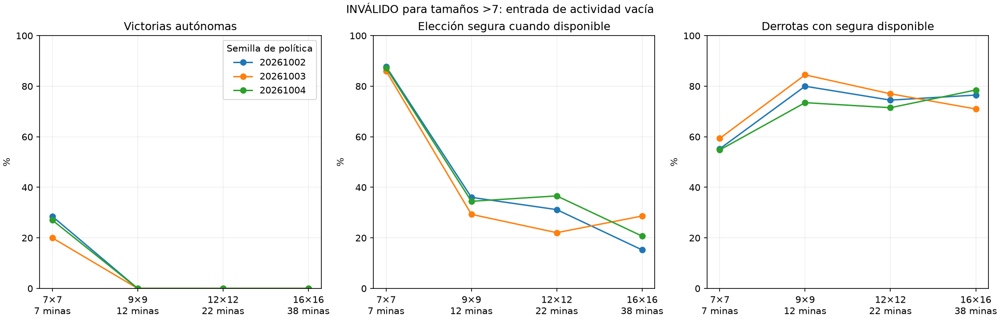

# Evaluación por dificultad

**INVALIDADA PARA TAMAÑOS MAYORES A 7.** La extracción histórica solo agrupaba actividad para 5/7; 9/12/16 recibieron mapas cero. Sus resultados no miden generalización del cerebro. La auditoría de conteos no detectaba este error semántico. Se conservan datos como diagnóstico del fallo. 

| Tablero/minas | Victorias por política (02 / 03 / 04) | Media e IC95% condicional |
|---|---|---|
| 7×7/7 | 57/200 / 40/200 / 54/200 | 25.2% [20.3, 30.3] |
| 9×9/12 | 0/200 / 0/200 / 0/200 | 0.0% [0.0, 0.0] |
| 12×12/22 | 0/200 / 0/200 / 0/200 | 0.0% [0.0, 0.0] |
| 16×16/38 | 0/200 / 0/200 / 0/200 | 0.0% [0.0, 0.0] |



Políticas fijadas antes del test, sin entrenamiento ni intervención del maestro. 800 layouts nuevos, 200 por tamaño, compartidos por tres políticas sobre un cerebro. Victorias automáticas excluidas; el denominador se muestra por política. El intervalo remuestrea layouts conjuntamente entre políticas; no mide variabilidad entre cerebros. Con cero victorias el bootstrap es degenerado [0,0] y no demuestra probabilidad verdadera cero. Densidad cercana a 15%, tamaños y número de minas cambian juntos. El solver solo certifica un subconjunto de lo deducible. Las derrotas tras riesgo exacto de 50% se cuentan aparte y no se convierten en victorias.

Auditoría de identidades, separación de layouts, conteos y hashes completada. No se cambiaron checkpoints ni agente servido.

```json
{
  "7": {
    "mines": 7,
    "per_seed": {
      "20261002": {
        "safe_choices": 1071,
        "safe_opportunities": 1220,
        "known_mine_choices": 57,
        "death_with_safe_available": 79,
        "death_after_exact_half_min_risk": 0,
        "wins": 57,
        "n": 200,
        "automatic_excluded": 0,
        "missed_safe_choices": 149
      },
      "20261003": {
        "safe_choices": 982,
        "safe_opportunities": 1141,
        "known_mine_choices": 65,
        "death_with_safe_available": 95,
        "death_after_exact_half_min_risk": 1,
        "wins": 40,
        "n": 200,
        "automatic_excluded": 0,
        "missed_safe_choices": 159
      },
      "20261004": {
        "safe_choices": 968,
        "safe_opportunities": 1109,
        "known_mine_choices": 50,
        "death_with_safe_available": 80,
        "death_after_exact_half_min_risk": 0,
        "wins": 54,
        "n": 200,
        "automatic_excluded": 0,
        "missed_safe_choices": 141
      }
    },
    "mean_win_percent": 25.16666666666667,
    "conditional_ci95_percent": [
      20.333333333333332,
      30.33333333333333
    ]
  },
  "9": {
    "mines": 12,
    "per_seed": {
      "20261002": {
        "safe_choices": 169,
        "safe_opportunities": 469,
        "known_mine_choices": 102,
        "death_with_safe_available": 160,
        "death_after_exact_half_min_risk": 0,
        "wins": 0,
        "n": 200,
        "automatic_excluded": 0,
        "missed_safe_choices": 300
      },
      "20261003": {
        "safe_choices": 158,
        "safe_opportunities": 539,
        "known_mine_choices": 97,
        "death_with_safe_available": 169,
        "death_after_exact_half_min_risk": 0,
        "wins": 0,
        "n": 200,
        "automatic_excluded": 0,
        "missed_safe_choices": 381
      },
      "20261004": {
        "safe_choices": 151,
        "safe_opportunities": 438,
        "known_mine_choices": 88,
        "death_with_safe_available": 147,
        "death_after_exact_half_min_risk": 0,
        "wins": 0,
        "n": 200,
        "automatic_excluded": 0,
        "missed_safe_choices": 287
      }
    },
    "mean_win_percent": 0.0,
    "conditional_ci95_percent": [
      0.0,
      0.0
    ]
  },
  "12": {
    "mines": 22,
    "per_seed": {
      "20261002": {
        "safe_choices": 169,
        "safe_opportunities": 542,
        "known_mine_choices": 79,
        "death_with_safe_available": 149,
        "death_after_exact_half_min_risk": 0,
        "wins": 0,
        "n": 200,
        "automatic_excluded": 0,
        "missed_safe_choices": 373
      },
      "20261003": {
        "safe_choices": 120,
        "safe_opportunities": 544,
        "known_mine_choices": 80,
        "death_with_safe_available": 154,
        "death_after_exact_half_min_risk": 0,
        "wins": 0,
        "n": 200,
        "automatic_excluded": 0,
        "missed_safe_choices": 424
      },
      "20261004": {
        "safe_choices": 190,
        "safe_opportunities": 519,
        "known_mine_choices": 78,
        "death_with_safe_available": 143,
        "death_after_exact_half_min_risk": 0,
        "wins": 0,
        "n": 200,
        "automatic_excluded": 0,
        "missed_safe_choices": 329
      }
    },
    "mean_win_percent": 0.0,
    "conditional_ci95_percent": [
      0.0,
      0.0
    ]
  },
  "16": {
    "mines": 38,
    "per_seed": {
      "20261002": {
        "safe_choices": 93,
        "safe_opportunities": 610,
        "known_mine_choices": 58,
        "death_with_safe_available": 153,
        "death_after_exact_half_min_risk": 0,
        "wins": 0,
        "n": 200,
        "automatic_excluded": 0,
        "missed_safe_choices": 517
      },
      "20261003": {
        "safe_choices": 149,
        "safe_opportunities": 520,
        "known_mine_choices": 70,
        "death_with_safe_available": 142,
        "death_after_exact_half_min_risk": 0,
        "wins": 0,
        "n": 200,
        "automatic_excluded": 0,
        "missed_safe_choices": 371
      },
      "20261004": {
        "safe_choices": 129,
        "safe_opportunities": 623,
        "known_mine_choices": 64,
        "death_with_safe_available": 157,
        "death_after_exact_half_min_risk": 0,
        "wins": 0,
        "n": 200,
        "automatic_excluded": 0,
        "missed_safe_choices": 494
      }
    },
    "mean_win_percent": 0.0,
    "conditional_ci95_percent": [
      0.0,
      0.0
    ]
  }
}
```
